# System Architecture Overview

> **Document ID:** arch-001
> **Phiên bản:** 2.0.0
> **Ngày:** 2026-04-25

---

## 1. System Overview

Hệ thống **BookStore E-Commerce** là một ứng dụng thương mại điện tử bán sách, được xây dựng theo kiến trúc **Full-Stack** với:

- **Frontend:** Next.js 16 (App Router) - TypeScript, React 19
- **Backend:** Spring Boot 4.0.1 - Java 21, REST API
- **Database:** MySQL 8.x

---

## 2. High-Level Architecture

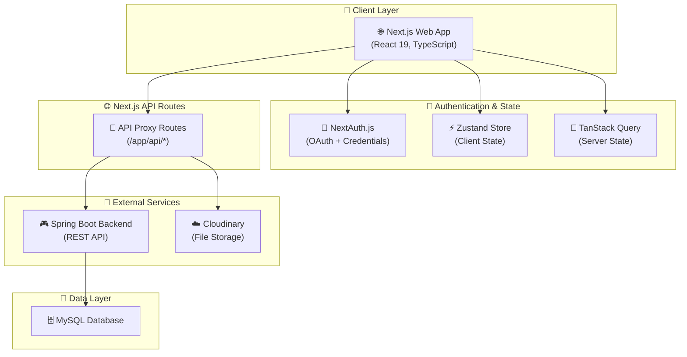

---

## 3. Frontend Architecture (Next.js)

### 3.1 Directory Structure

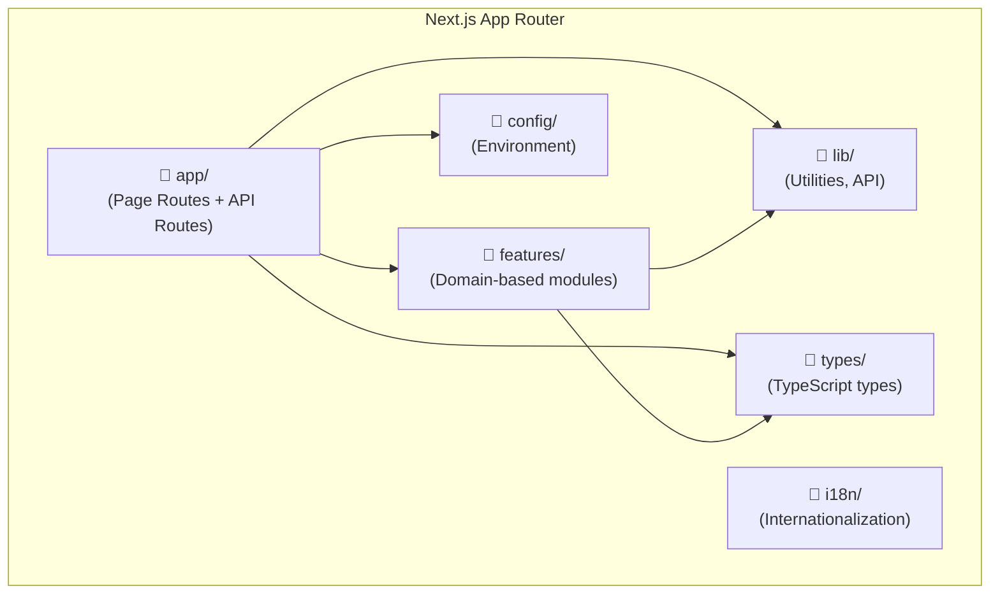

### 3.2 Page Routes

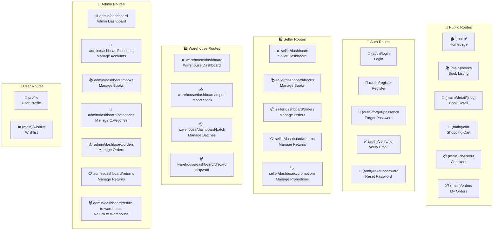

### 3.3 API Routes (Frontend Proxy)

Frontend sử dụng Next.js API Routes làm proxy để gọi backend:

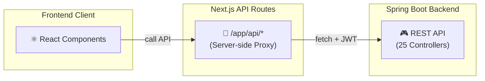

**API Endpoints mapping:**

| Frontend Route | Backend Controller |
|--------------|-------------------|
| `/api/auth/*` | AuthController |
| `/api/books/*` | BookController |
| `/api/orders/*` | OrderController |
| `/api/carts/*` | CartController |
| `/api/cart-items/*` | CartItemController |
| `/api/categories/*` | CategoryController |
| `/api/promotions/*` | PromotionController |
| `/api/users/*` | UserController |
| `/api/addresses/*` | AddressController |
| `/api/batches/*` | BatchController |
| `/api/import-stocks/*` | ImportStockController |
| `/api/stock-requests/*` | StockRequestController |
| `/api/purchase-orders/*` | PurchaseOrderController |
| `/api/return-requests/*` | ReturnRequestController |
| `/api/disposal-requests/*` | DisposalRequestController |
| `/api/variants/*` | VariantController |
| `/api/suppliers/*` | SupplierController |
| `/api/cloudinary/*` | CloudinaryController |

---

## 4. Backend Architecture (Spring Boot)

### 4.1 Layered Architecture

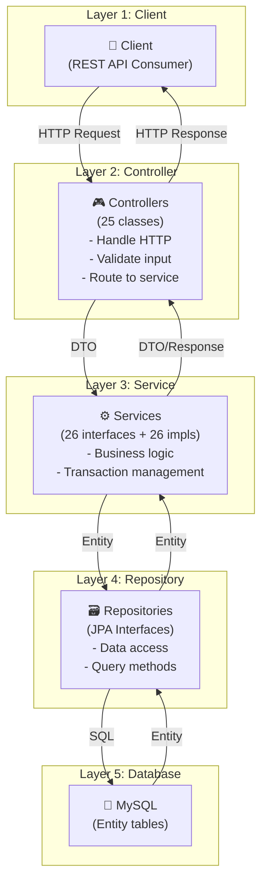

### 4.2 Security Architecture

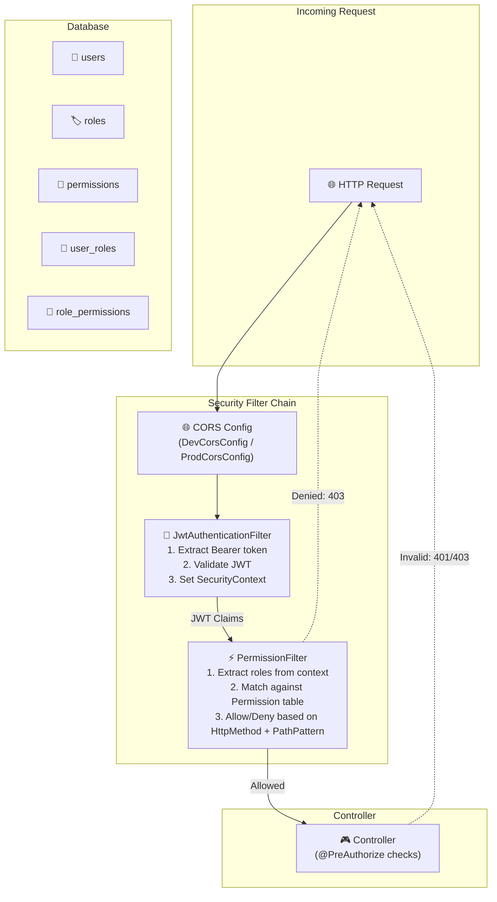

---

## 5. Authentication Flow

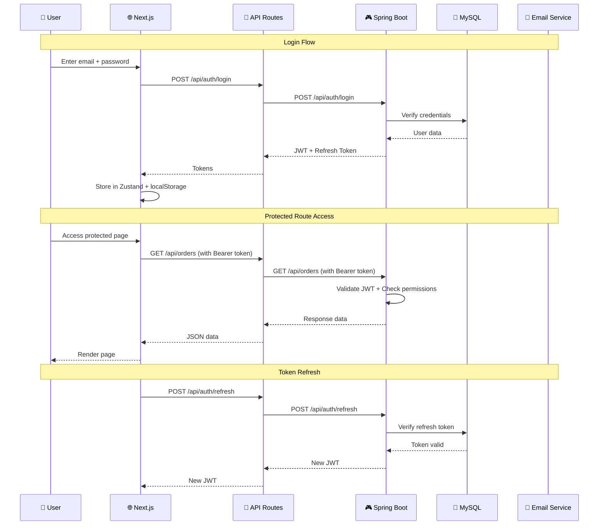

---

## 6. Module Structure (Backend)

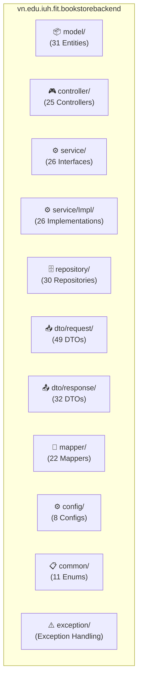

---

## 7. Tech Stack Summary

### Frontend
| Component | Technology | Version |
|-----------|------------|---------|
| Framework | Next.js | 16.1.4 |
| Language | TypeScript | 5 |
| UI Library | Radix UI + Tailwind CSS | Latest |
| State (Client) | Zustand | 5.0.11 |
| State (Server) | TanStack Query | 5.90.21 |
| HTTP Client | Fetch API | Native |
| Validation | Zod + React Hook Form | 4.3.6 / 7.71.1 |
| Auth | NextAuth.js | 4.24.13 |
| i18n | i18next | 25.8.0 |
| Notifications | Sonner | 2.0.7 |

### Backend
| Component | Technology | Version |
|-----------|------------|---------|
| Framework | Spring Boot | 4.0.1 |
| Language | Java | 21 |
| Database | MySQL | 8.x |
| ORM | Spring Data JPA | (with Hibernate) |
| Security | Spring Security + JWT | OAuth2 Resource Server |
| JWT Library | java-jwt (Auth0) | 4.4.0 |
| Mapping | MapStruct | 1.5.5 |
| File Storage | Cloudinary | 1.38.0 |
| Email | Spring Mail | (built-in) |
| Build Tool | Maven | 3.x |

---

## 8. Domain Distribution

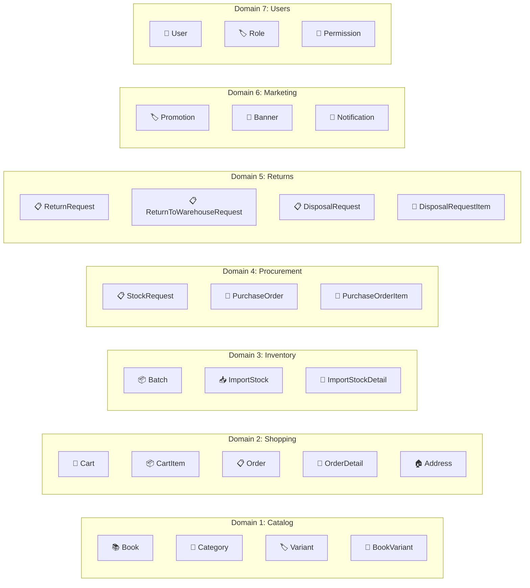

---

## 9. Role-Based Access Control

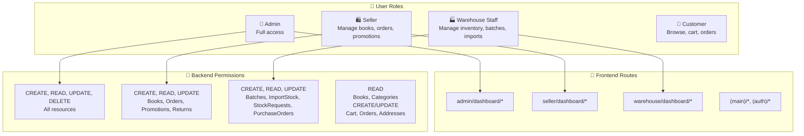

---

## 10. Data Flow - Full Stack

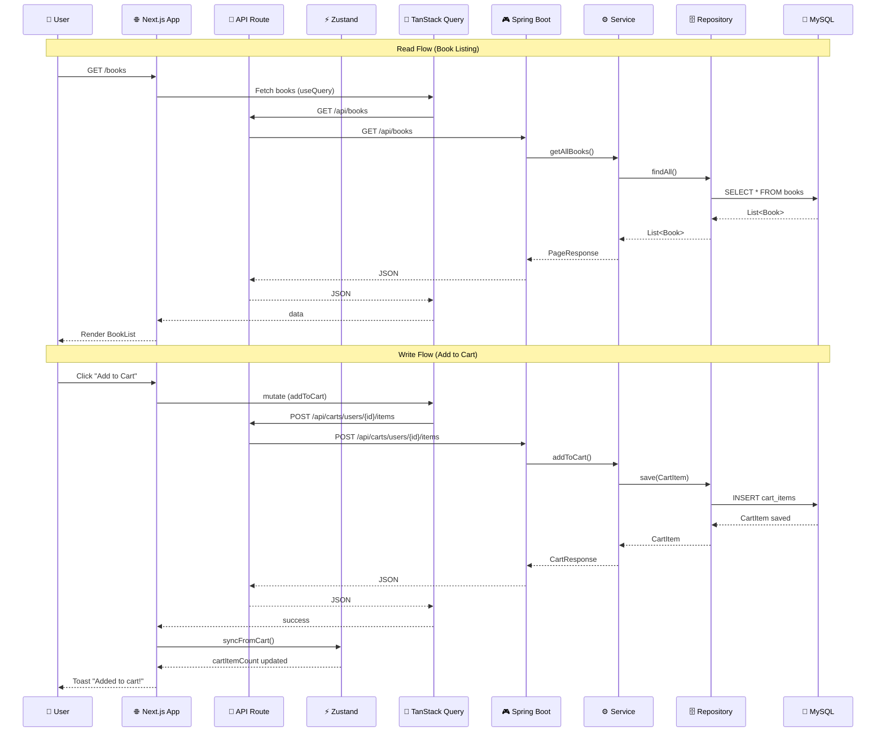

---

## 11. Deployment Overview

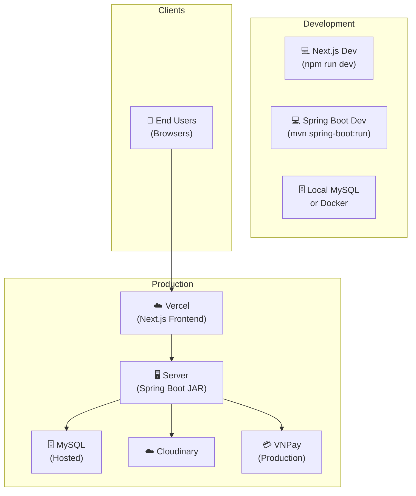

---

## 12. Key Design Patterns

| Pattern | Backend Usage | Frontend Usage |
|---------|---------------|----------------|
| **Layered Architecture** | Controller → Service → Repository → Entity | Page → Hook → API Route → Backend |
| **DTO Pattern** | Request DTOs / Response DTOs + MapStruct | TypeScript interfaces |
| **Repository Pattern** | Spring Data JPA repositories | TanStack Query cache |
| **State Management** | - | Zustand (client state) + TanStack Query (server state) |
| **Strategy Pattern** | Payment methods (VNPay/COD) | - |
| **Observer Pattern** | Notification system | React hooks (useEffect) |
| **Feature-Based Organization** | - | `features/*/` folder structure |
| **Proxy Pattern** | - | Next.js API Routes as backend proxy |

---

*Generated by Senior BA Agent | BookStore Backend | 2026-04-25*
