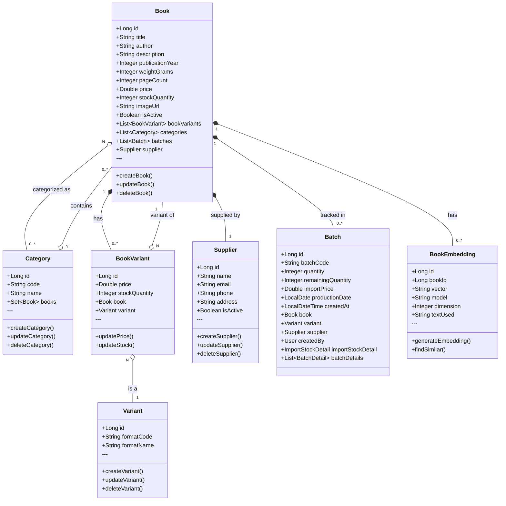

# Class Diagram - Catalog Domain

> **Document ID:** class-001
> **Phiên bản:** 1.0.0
> **Ngày:** 2026-04-25
> **Domain:** Catalog Management
> **Entities:** Book, Category, Variant, BookVariant

---

## 1. Class Diagram

---

## 2. Entity Details

### Book
| Field | Type | Constraints | Description |
|-------|------|-------------|-------------|
| id | Long | PK, AUTO | Primary key |
| title | String | NOT NULL, 500 | Book title |
| author | String | 255 | Author name |
| description | String | TEXT | Book description |
| publicationYear | Integer | - | Year of publication |
| weightGrams | Integer | - | Weight in grams |
| pageCount | Integer | - | Number of pages |
| price | Double | NOT NULL | Selling price (VND) |
| stockQuantity | Integer | NOT NULL | Available stock |
| imageUrl | String | 1000 | Cover image URL |
| isActive | Boolean | - | Soft delete flag |

### Category
| Field | Type | Constraints | Description |
|-------|------|-------------|-------------|
| id | Long | PK, AUTO | Primary key |
| code | String | UNIQUE, NOT NULL | Category code |
| name | String | NOT NULL | Category name |

### Variant
| Field | Type | Constraints | Description |
|-------|------|-------------|-------------|
| id | Long | PK, AUTO | Primary key |
| formatCode | String | 100 | Format code (e.g., "HB", "PB") |
| formatName | String | 255 | Format name (e.g., "Hardcover") |

### BookVariant
| Field | Type | Constraints | Description |
|-------|------|-------------|-------------|
| id | Long | PK, AUTO | Primary key |
| price | Double | NOT NULL | Price for this variant |
| stockQuantity | Integer | NOT NULL | Stock for this variant |

---

## 3. API Endpoints

### BookController (`/api/books`)
| Method | Endpoint | Auth | Description |
|--------|----------|------|-------------|
| POST | `/` | Yes | Create book |
| GET | `/` | No | Get all (paginated) |
| GET | `/all` | No | Get all (no pagination) |
| GET | `/sorted` | No | Get sorted |
| GET | `/category/{categoryId}` | No | By category |
| GET | `/supplier/{supplierId}` | No | By supplier |
| GET | `/{bookId}` | No | Get by ID |
| GET | `/{bookId}/similar` | Yes | Find similar (AI) |
| PUT | `/{bookId}` | Yes | Update book |
| DELETE | `/{bookId}` | Yes | Delete book |

### CategoryController (`/api/categories`)
| Method | Endpoint | Auth | Description |
|--------|----------|------|-------------|
| POST | `/` | Yes | Create category |
| GET | `/` | No | Get all |
| GET | `/{categoryId}` | No | Get by ID |
| GET | `/code/{code}` | No | Get by code |
| PUT | `/{categoryId}` | Yes | Update |
| DELETE | `/{categoryId}` | Yes | Delete |

### VariantController (`/api/variants`)
| Method | Endpoint | Auth | Description |
|--------|----------|------|-------------|
| POST | `/` | Yes | Create variant |
| GET | `/` | No | Get all |
| GET | `/book/{bookId}` | No | By book |
| GET | `/{variantId}` | No | Get by ID |
| PUT | `/{variantId}` | Yes | Update |
| DELETE | `/{variantId}` | Yes | Delete |

### BookVariantController (`/api/book-variants`)
| Method | Endpoint | Auth | Description |
|--------|----------|------|-------------|
| POST | `/` | Yes | Create |
| GET | `/` | No | Get all |
| GET | `/{id}` | No | Get by ID |
| GET | `/book/{bookId}` | No | By book |
| GET | `/variant/{variantId}` | No | By variant |
| PUT | `/{id}` | Yes | Update |
| DELETE | `/{id}` | Yes | Delete |

---

## 4. Business Rules

| Rule | Description |
|------|-------------|
| BR-001 | Book must belong to at least one Category |
| BR-002 | BookVariant = Book + Variant combination |
| BR-003 | Book.stockQuantity = sum(Batch.remainingQuantity) |
| BR-004 | Only isActive=true books are displayed |

---

## 5. Related Documents

- **ER Diagram:** `er-diagram/er-001-full.md`
- **Use Case:** `usecase/uc-001.md`
- **Sequence:** `sequence/seq-001.md`

---

*Generated by Senior BA Agent | BookStore Backend | 2026-04-25*
