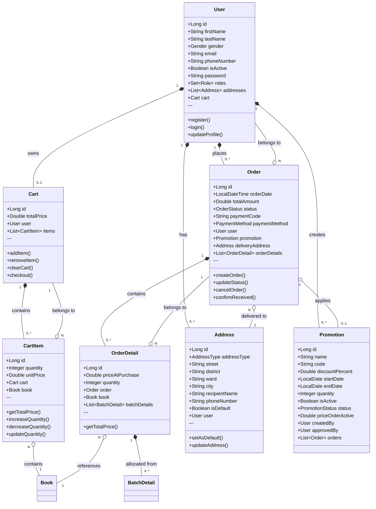
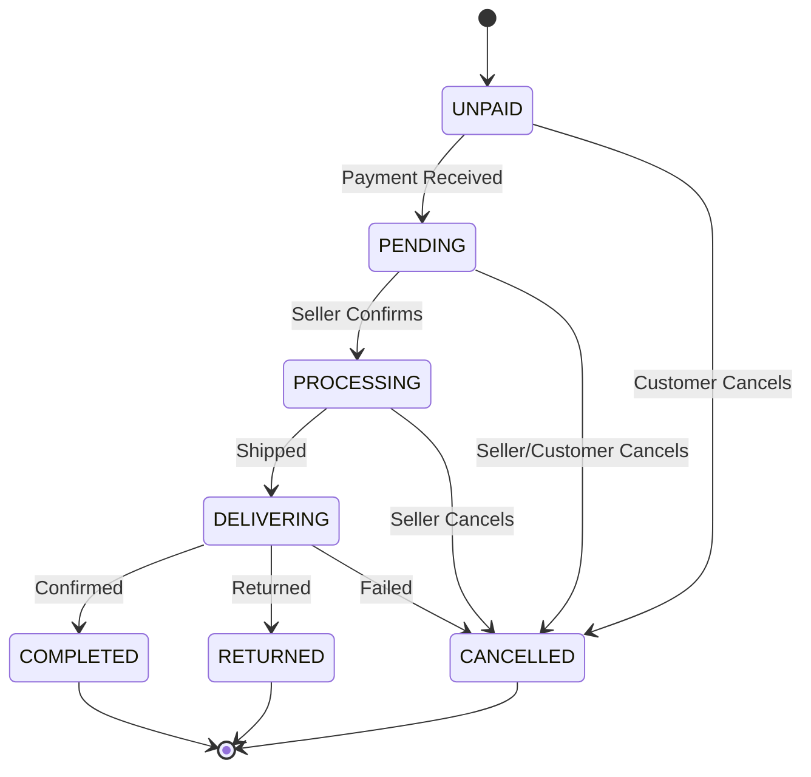

# Class Diagram - Order Domain

> **Document ID:** class-002
> **Phiên bản:** 1.0.0
> **Ngày:** 2026-04-25
> **Domain:** Order & Shopping
> **Entities:** Order, OrderDetail, Cart, CartItem, Address

---

## 1. Class Diagram

---

## 2. Order Status Enum

---

## 3. Entity Details

### Order
| Field | Type | Constraints | Description |
|-------|------|-------------|-------------|
| id | Long | PK, AUTO | Primary key |
| orderDate | LocalDateTime | NOT NULL | Order timestamp |
| totalAmount | Double | NOT NULL | Total order amount |
| status | OrderStatus | NOT NULL | Current status |
| paymentCode | String | 100 | Payment reference |
| paymentMethod | PaymentMethod | 50 | VNPAY / COD |

### OrderDetail
| Field | Type | Constraints | Description |
|-------|------|-------------|-------------|
| id | Long | PK, AUTO | Primary key |
| priceAtPurchase | Double | NOT NULL | Price at time of order |
| quantity | Integer | NOT NULL | Quantity ordered |

### Cart
| Field | Type | Constraints | Description |
|-------|------|-------------|-------------|
| id | Long | PK, AUTO | Primary key |
| totalPrice | Double | - | Sum of items |
| user | User | UNIQUE, NOT NULL | Owner |

### CartItem
| Field | Type | Constraints | Description |
|-------|------|-------------|-------------|
| id | Long | PK, AUTO | Primary key |
| quantity | Integer | NOT NULL, default 1 | Qty in cart |
| unitPrice | Double | NOT NULL | Price per unit |

### Address
| Field | Type | Constraints | Description |
|-------|------|-------------|-------------|
| id | Long | PK, AUTO | Primary key |
| addressType | AddressType | - | HOME/WORK/SHIPPING/BILLING |
| street | String | 500 | Street address |
| district | String | 255 | District |
| ward | String | 255 | Ward |
| city | String | 255 | City |
| recipientName | String | 255 | Recipient name |
| phoneNumber | String | 30 | Contact phone |
| isDefault | Boolean | - | Default address |

---

## 4. API Endpoints

### OrderController (`/api/orders`)
| Method | Endpoint | Auth | Description |
|--------|----------|------|-------------|
| POST | `/` | Yes | Create order |
| GET | `/my` | Yes | My orders |
| GET | `/{orderId}` | Yes | Get by ID |
| PUT | `/{orderId}/status` | Yes | Update status |
| PUT | `/{orderId}/payment-method` | Yes | Update payment |
| PUT | `/{orderId}/cancel` | Yes | Cancel order |
| PUT | `/{orderId}/confirm-received` | Yes | Confirm delivery |
| PUT | `/{orderId}/pay-cod` | Yes | Pay COD |
| GET | `/` | Yes | Get all (admin) |

### CartController (`/api/carts`)
| Method | Endpoint | Auth | Description |
|--------|----------|------|-------------|
| GET | `/current` | Yes | Current user cart |
| GET | `/users/{userId}` | Yes | User cart |
| POST | `/users/{userId}/items` | Yes | Add item |
| DELETE | `/users/{userId}` | Yes | Clear cart |
| GET | `/current/checkout` | Yes | Checkout |
| POST | `/users/{userId}/checkout` | Yes | Checkout |

### CartItemController (`/api/cart-items`)
| Method | Endpoint | Auth | Description |
|--------|----------|------|-------------|
| GET | `/{cartItemId}` | Yes | Get item |
| PATCH | `/{cartItemId}/increase` | Yes | +1 quantity |
| PATCH | `/{cartItemId}/decrease` | Yes | -1 quantity |
| PUT | `/{cartItemId}/quantity` | Yes | Set quantity |
| DELETE | `/{cartItemId}` | Yes | Remove |

### AddressController (`/api/users/{userId}/addresses`)
| Method | Endpoint | Auth | Description |
|--------|----------|------|-------------|
| GET | `/` | Yes | List addresses |
| POST | `/` | Yes | Create address |
| GET | `/{id}` | Yes | Get by ID |
| PUT | `/{id}` | Yes | Update |
| DELETE | `/{id}` | Yes | Delete |
| PUT | `/{id}/default` | Yes | Set default |

### PaymentController (`/api/payments`)
| Method | Endpoint | Auth | Description |
|--------|----------|------|-------------|
| POST | `/vnpay/create/{orderId}` | Yes | Create VNPay URL |
| GET | `/vnpay/return` | No | VNPay callback |

---

## 5. Business Rules

| Rule | Description |
|------|-------------|
| BR-001 | Cart = 1:1 với User (mỗi user 1 cart) |
| BR-002 | CartItem.unitPrice = giá tại thời điểm thêm vào |
| BR-003 | Cart.totalPrice = sum(CartItem.unitPrice * CartItem.quantity) |
| BR-004 | Checkout: CartItems → OrderDetails, xóa CartItems |
| BR-005 | Chỉ UNPAID/PENDING orders mới được hủy |
| BR-006 | VNPay callback phải verify signature |
| BR-007 | Order.paymentCode lưu mã giao dịch VNPay |

---

## 6. Related Documents

- **ER Diagram:** `er-diagram/er-001-full.md`
- **Use Case:** `usecase/uc-003.md`, `usecase/uc-004.md`
- **Sequence:** `sequence/seq-003.md`, `sequence/seq-004.md`
- **State Machine:** `state/state-001-order.md`

---

*Generated by Senior BA Agent | BookStore Backend | 2026-04-25*
