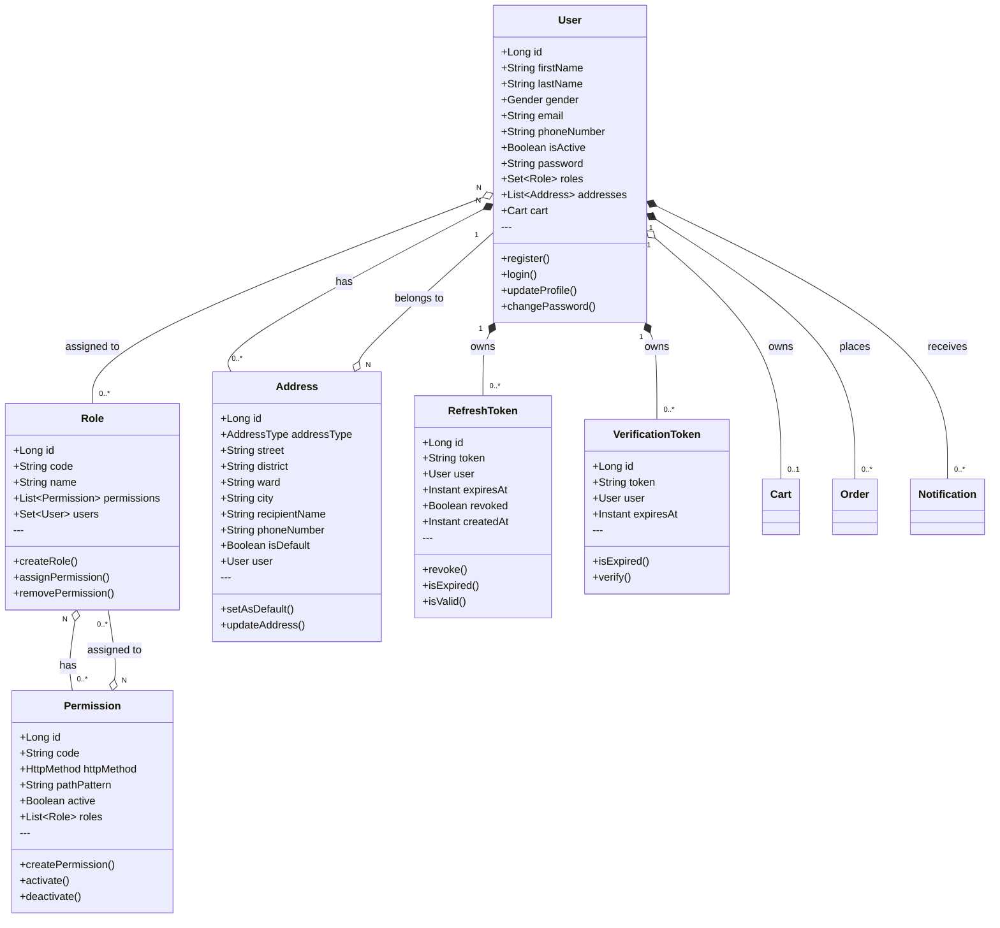
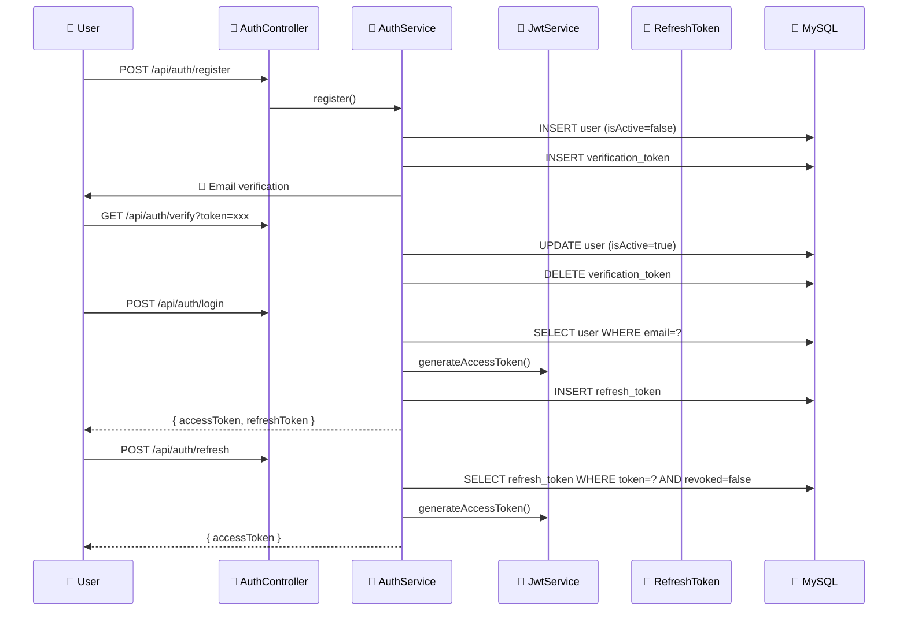

# Class Diagram - User & Auth Domain

> **Document ID:** class-003
> **Phiên bản:** 1.0.0
> **Ngày:** 2026-04-25
> **Domain:** User Management & Authentication
> **Entities:** User, Role, Permission, Address, RefreshToken, VerificationToken

---

## 1. Class Diagram



---

## 2. Role Types

| Role Code | Name | Description |
|-----------|------|-------------|
| ADMIN | Administrator | Full system access |
| USER | User | Authenticated customer |
| SELLER | Seller | Sales staff |
| WAREHOUSE_STAFF | Warehouse Staff | Inventory management |
| GUEST | Guest | Unauthenticated (not stored) |

---

## 3. Permission Model

```mermaid
flowchart LR
    subgraph "Permission Structure"
        P["🔐 Permission\n- code: \"BOOK_CREATE\"\n- httpMethod: \"POST\"\n- pathPattern: \"/api/books/**\""]
    end

    subgraph "Role-Permission Assignment"
        R1["🏷️ ADMIN"]
        R2["🏷️ SELLER"]
        R3["🏷️ WAREHOUSE_STAFF"]
    end

    subgraph "User-Role Assignment"
        U1["👤 User A\n(Roles: USER)"]
        U2["👤 User B\n(Roles: SELLER)"]
        U3["👤 User C\n(Roles: ADMIN)"]
    end

    P --> R1
    P --> R2
    P --> R3
    R1 --> U3
    R2 --> U2
```

---

## 4. Authentication Flow



---

## 5. Entity Details

### User
| Field | Type | Constraints | Description |
|-------|------|-------------|-------------|
| id | Long | PK, AUTO | Primary key |
| firstName | String | 255 | First name |
| lastName | String | 255 | Last name |
| gender | Gender | - | MALE/FEMALE/OTHER |
| email | String | UNIQUE, NOT NULL | Email |
| phoneNumber | String | 30 | Phone number |
| isActive | Boolean | NOT NULL | Account active |
| password | String | NOT NULL, 255 | BCrypt hash |

### Role
| Field | Type | Constraints | Description |
|-------|------|-------------|-------------|
| id | Long | PK, AUTO | Primary key |
| code | String | NOT NULL, 100 | Role code |
| name | String | NOT NULL | Role name |

### Permission
| Field | Type | Constraints | Description |
|-------|------|-------------|-------------|
| id | Long | PK, AUTO | Primary key |
| code | String | UNIQUE, NOT NULL | Permission code |
| httpMethod | HttpMethod | NOT NULL | GET/POST/PUT/PATCH/DELETE |
| pathPattern | String | NOT NULL | API path pattern |
| active | Boolean | NOT NULL | Is active |

### RefreshToken
| Field | Type | Constraints | Description |
|-------|------|-------------|-------------|
| id | Long | PK, AUTO | Primary key |
| token | String | NOT NULL, 500 | Token value |
| expiresAt | Instant | NOT NULL | Expiry time |
| revoked | Boolean | NOT NULL | Revoked flag |

### VerificationToken
| Field | Type | Constraints | Description |
|-------|------|-------------|-------------|
| id | Long | PK, AUTO | Primary key |
| token | String | UNIQUE, NOT NULL | Token value |
| expiresAt | Instant | - | Expiry time |

---

## 6. API Endpoints

### AuthController (`/api/auth`)
| Method | Endpoint | Auth | Description |
|--------|----------|------|-------------|
| POST | `/register` | No | Register |
| GET | `/verify` | No | Verify email |
| POST | `/verify/{userId}` | No | Verify email |
| POST | `/login` | No | Login |
| POST | `/refresh` | No | Refresh token |
| POST | `/logout` | No | Logout |
| POST | `/change-password` | Yes | Change password |

### UserController (`/api/users`)
| Method | Endpoint | Auth | Description |
|--------|----------|------|-------------|
| POST | `/` | Admin | Create user |
| GET | `/` | Admin | Get all users |
| GET | `/me` | Yes | Current user |
| GET | `/{id}` | Yes | Get by ID |
| PUT | `/{id}` | Yes | Update user |
| PATCH | `/{id}/active` | Admin | Set active |
| PATCH | `/{id}/roles/codes` | Admin | Set roles |
| DELETE | `/{id}` | Admin | Delete user |

### RoleController (`/api/roles`)
| Method | Endpoint | Auth | Description |
|--------|----------|------|-------------|
| POST | `/` | Admin | Create role |
| GET | `/` | Admin | Get all |
| GET | `/{id}` | Admin | Get by ID |
| PUT | `/{id}` | Admin | Update |
| DELETE | `/{id}` | Admin | Delete |

### PermissionController (`/api/permissions`)
| Method | Endpoint | Auth | Description |
|--------|----------|------|-------------|
| POST | `/` | Admin | Create permission |
| GET | `/` | Admin | Get all |
| GET | `/{id}` | Admin | Get by ID |
| PUT | `/{id}` | Admin | Update |
| DELETE | `/{id}` | Admin | Delete |
| POST | `/assign` | Admin | Create & assign |
| GET | `/role/{code}` | Admin | By role |

---

## 7. Related Documents

- **ER Diagram:** `er-diagram/er-001-full.md`
- **Use Case:** `usecase/uc-002.md`, `usecase/uc-009.md`
- **Sequence:** `sequence/seq-002.md`

---

*Generated by Senior BA Agent | BookStore Backend | 2026-04-25*
