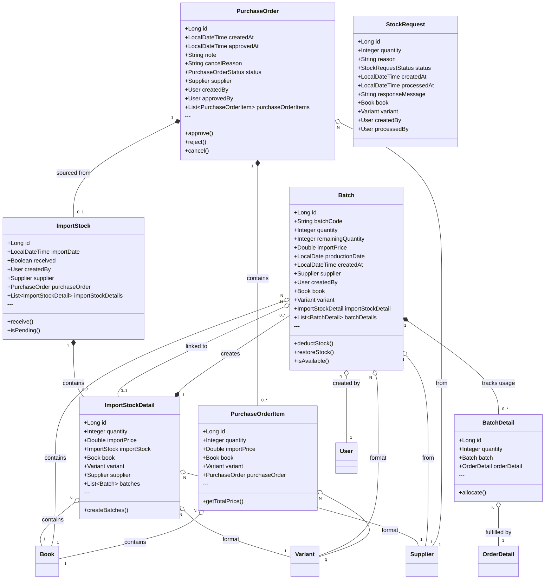
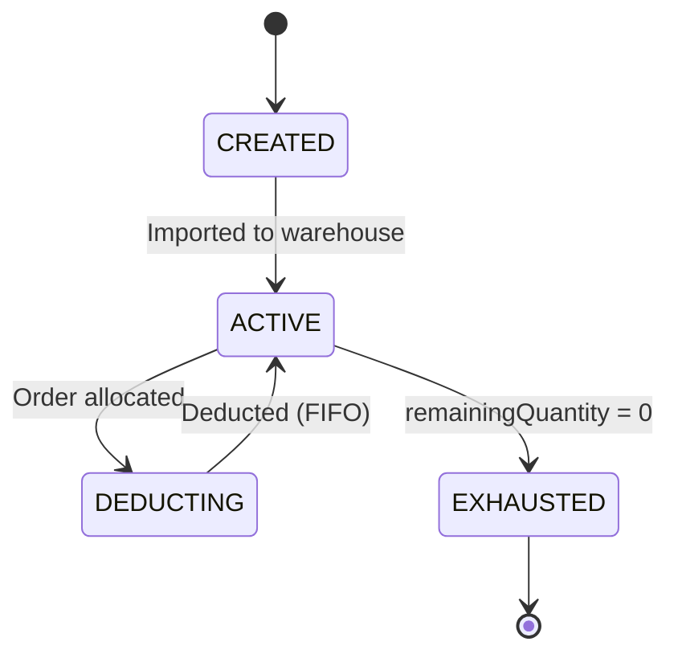
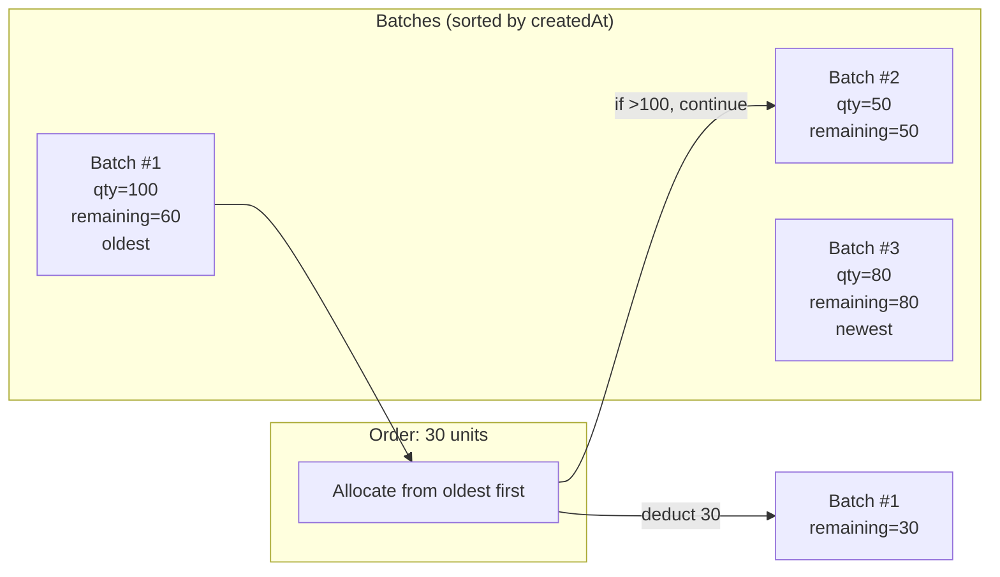

# Class Diagram - Inventory Domain

> **Document ID:** class-004
> **Phiên bản:** 1.0.0
> **Ngày:** 2026-04-25
> **Domain:** Inventory & Warehouse
> **Entities:** Batch, BatchDetail, ImportStock, ImportStockDetail

---

## 1. Class Diagram

---

## 2. Batch Lifecycle

---

## 3. FIFO Stock Allocation

---

## 4. Entity Details

### Batch
| Field | Type | Constraints | Description |
|-------|------|-------------|-------------|
| id | Long | PK, AUTO | Primary key |
| batchCode | String | UNIQUE, NOT NULL | Batch identifier |
| quantity | Integer | NOT NULL | Original quantity |
| remainingQuantity | Integer | NOT NULL | Available quantity |
| importPrice | Double | NOT NULL | Cost price |
| productionDate | LocalDate | - | Production date |
| createdAt | LocalDateTime | NOT NULL | Import timestamp |

### ImportStock
| Field | Type | Constraints | Description |
|-------|------|-------------|-------------|
| id | Long | PK, AUTO | Primary key |
| importDate | LocalDateTime | NOT NULL | Import date |
| received | Boolean | NOT NULL | Received flag |

### StockRequest
| Field | Type | Constraints | Description |
|-------|------|-------------|-------------|
| id | Long | PK, AUTO | Primary key |
| quantity | Integer | NOT NULL | Requested quantity |
| reason | String | 1000 | Reason for request |
| status | StockRequestStatus | NOT NULL | PENDING/APPROVED/REJECTED/ORDERED |

### PurchaseOrder
| Field | Type | Constraints | Description |
|-------|------|-------------|-------------|
| id | Long | PK, AUTO | Primary key |
| createdAt | LocalDateTime | NOT NULL | Created timestamp |
| approvedAt | LocalDateTime | - | Approved timestamp |
| note | String | 1000 | Notes |
| cancelReason | String | 1000 | Cancel reason |
| status | PurchaseOrderStatus | NOT NULL | Status |

---

## 5. API Endpoints

### BatchController (`/api/batches`)
| Method | Endpoint | Auth | Description |
|--------|----------|------|-------------|
| POST | `/` | Yes | Create batch |
| GET | `/{batchId}` | No | Get by ID |
| GET | `/` | No | Get all |
| GET | `/book/{bookId}` | No | By book |
| GET | `/book/{bookId}/available` | No | Available (FIFO) |
| GET | `/book/{bookId}/total-stock` | No | Total stock |
| PUT | `/book/{bookId}/sync-stock` | Yes | Sync stock |
| POST | `/details` | Yes | Create batch detail |

### ImportStockController (`/api/import-stocks`)
| Method | Endpoint | Auth | Description |
|--------|----------|------|-------------|
| POST | `/` | Yes | Create import |
| GET | `/` | Yes | Get all |
| GET | `/{id}` | Yes | Get by ID |
| GET | `/book/{bookId}` | Yes | Import history |
| POST | `/{id}/receive` | Yes | Receive stock |

### StockRequestController (`/api/stock-requests`)
| Method | Endpoint | Auth | Description |
|--------|----------|------|-------------|
| POST | `/` | Seller | Create request |
| GET | `/my-requests` | Yes | My requests |
| GET | `/` | Yes | Get all |
| PUT | `/{id}/approve` | Yes | Approve |
| PUT | `/{id}/reject` | Yes | Reject |

### PurchaseOrderController (`/api/purchase-orders`)
| Method | Endpoint | Auth | Description |
|--------|----------|------|-------------|
| POST | `/` | Yes | Create PO |
| POST | `/from-stock-request` | Yes | Create from SR |
| GET | `/` | Yes | Get all |
| GET | `/{id}` | Yes | Get by ID |
| PUT | `/{id}/approve` | Yes | Approve |
| PUT | `/{id}/reject` | Yes | Reject |
| PUT | `/{id}/cancel` | Yes | Cancel |
| POST | `/{id}/pay` | Yes | Pay |

---

## 6. Business Rules

| Rule | Description |
|------|-------------|
| BR-001 | FIFO: Batches sorted by createdAt (oldest first) |
| BR-002 | Batch.remainingQuantity = Batch.quantity - sum(BatchDetail.quantity) |
| BR-003 | ImportStock.receive() tạo Batch cho mỗi ImportStockDetail |
| BR-004 | BatchService.syncStockToBook() = sum(Batch.remainingQuantity) |
| BR-005 | StockRequest → PurchaseOrder: Nhiều SR → 1 PO |
| BR-006 | PurchaseOrder → ImportStock: 1 PO → nhiều ImportStock |

---

## 7. Related Documents

- **ER Diagram:** `er-diagram/er-001-full.md`
- **Use Case:** `usecase/uc-006.md`, `usecase/uc-010.md`
- **Sequence:** `sequence/seq-006.md`, `sequence/seq-010.md`

---

*Generated by Senior BA Agent | BookStore Backend | 2026-04-25*
