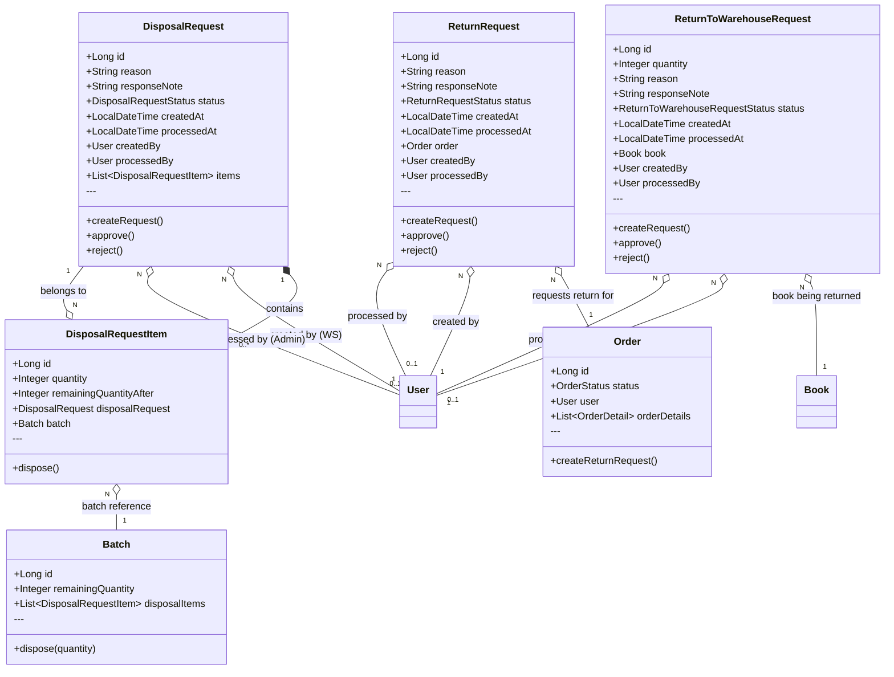
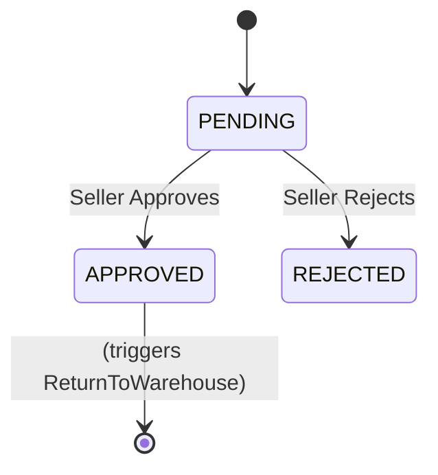
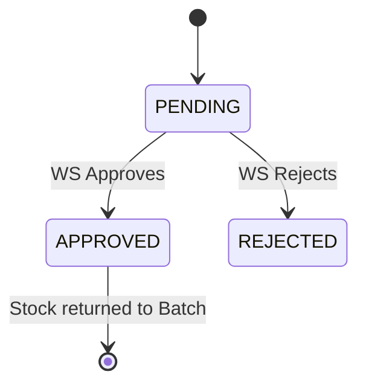
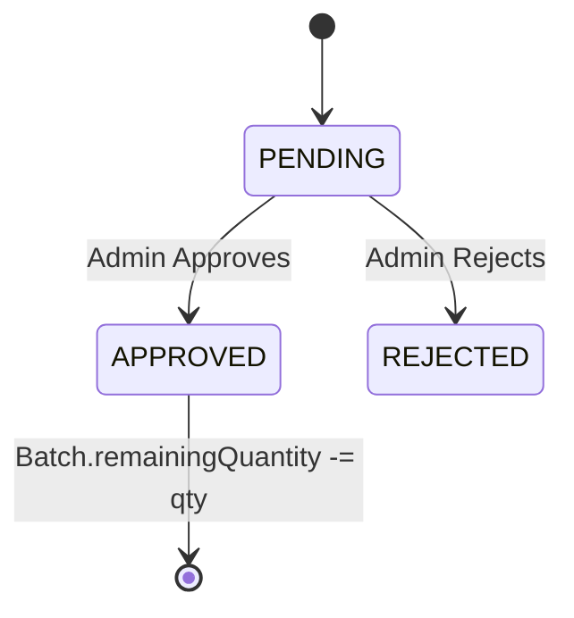
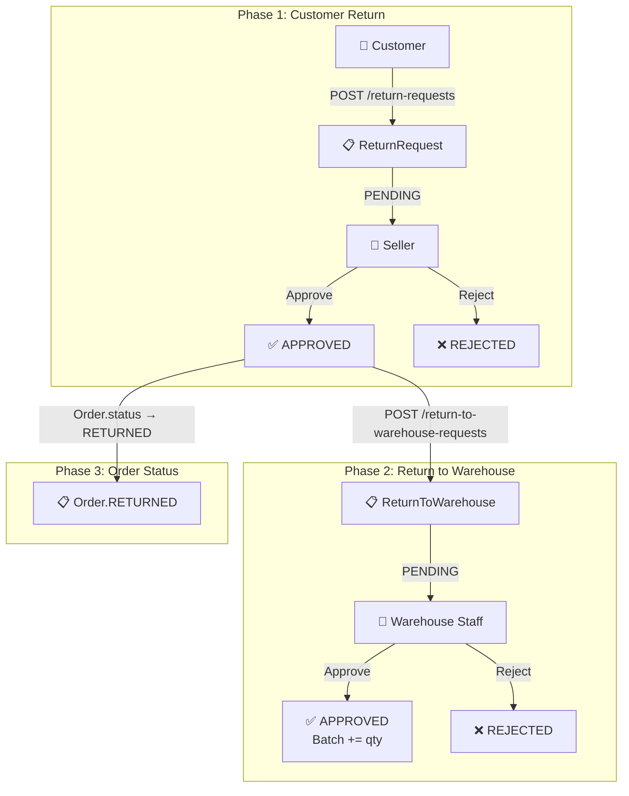
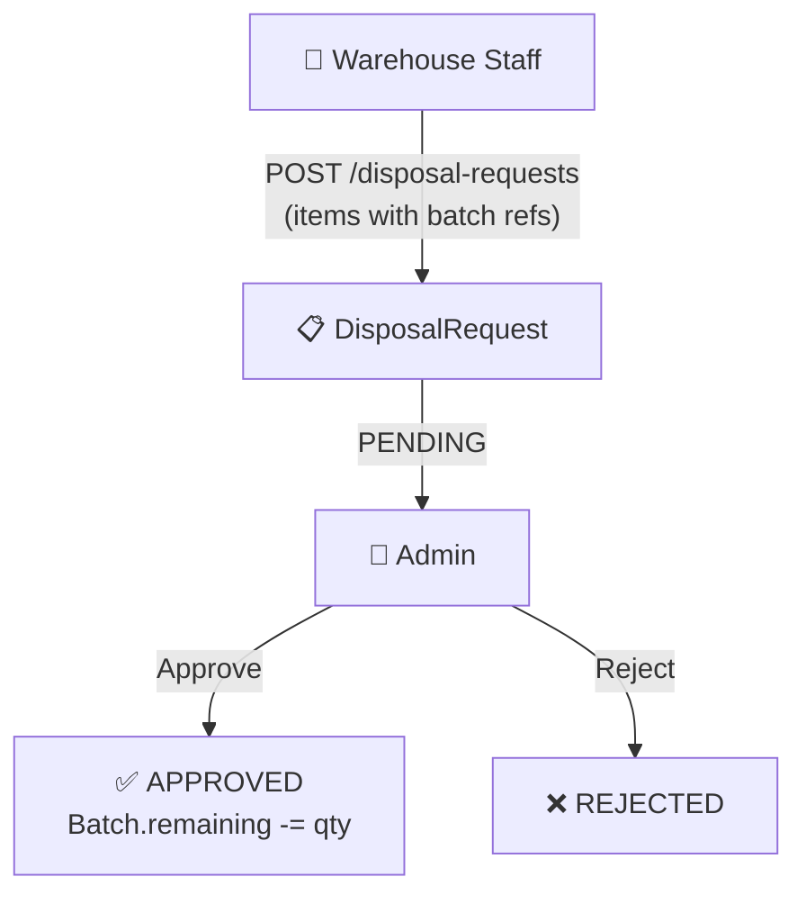

# Class Diagram - Returns & Disposal Domain

> **Document ID:** class-006
> **Phiên bản:** 1.0.0
> **Ngày:** 2026-04-25
> **Domain:** Returns & Disposals
> **Entities:** ReturnRequest, ReturnToWarehouseRequest, DisposalRequest, DisposalRequestItem

---

## 1. Class Diagram

---

## 2. Status Flows

### ReturnRequest Status

### ReturnToWarehouseRequest Status

### DisposalRequest Status

---

## 3. Return Flow (Customer Return)

---

## 4. Disposal Flow

---

## 5. Entity Details

### ReturnRequest
| Field | Type | Constraints | Description |
|-------|------|-------------|-------------|
| id | Long | PK, AUTO | Primary key |
| reason | String | 1000 | Reason for return |
| responseNote | String | 1000 | Seller response |
| status | ReturnRequestStatus | NOT NULL | PENDING/APPROVED/REJECTED |

### DisposalRequest
| Field | Type | Constraints | Description |
|-------|------|-------------|-------------|
| id | Long | PK, AUTO | Primary key |
| reason | String | 1000 | Reason for disposal |
| responseNote | String | 1000 | Admin response |
| status | DisposalRequestStatus | NOT NULL | PENDING/APPROVED/REJECTED |

### DisposalRequestItem
| Field | Type | Constraints | Description |
|-------|------|-------------|-------------|
| id | Long | PK, AUTO | Primary key |
| quantity | Integer | NOT NULL | Qty to dispose |
| remainingQuantityAfter | Integer | - | Stock after disposal |

---

## 6. API Endpoints

### ReturnRequestController (`/api/return-requests`)
| Method | Endpoint | Auth | Description |
|--------|----------|------|-------------|
| POST | `/` | Yes | Create request |
| GET | `/my-requests` | Yes | My requests |
| GET | `/` | Yes | Get all |
| PUT | `/{id}/approve` | Seller | Approve |
| PUT | `/{id}/reject` | Seller | Reject |

### ReturnToWarehouseRequestController (`/api/return-to-warehouse-requests`)
| Method | Endpoint | Auth | Description |
|--------|----------|------|-------------|
| POST | `/` | Seller | Create request |
| GET | `/my-requests` | Yes | My requests |
| GET | `/` | Yes | Get all |
| PUT | `/{id}/approve` | WS | Approve |
| PUT | `/{id}/reject` | WS | Reject |

### DisposalRequestController (`/api/disposal-requests`)
| Method | Endpoint | Auth | Description |
|--------|----------|------|-------------|
| POST | `/` | WS | Create request |
| GET | `/my-requests` | Yes | My requests |
| GET | `/` | Yes | Get all |
| GET | `/{id}` | Yes | Get by ID |
| PUT | `/{id}/approve` | Admin | Approve |
| PUT | `/{id}/reject` | Admin | Reject |

---

## 7. Business Rules

| Rule | Description |
|------|-------------|
| BR-001 | DisposalRequestItem link đến Batch để track số lượng thanh lý |
| BR-002 | Sau khi approve disposal: `Batch.remainingQuantity -= item.quantity` |
| BR-003 | ReturnToWarehouse tăng `Batch.remainingQuantity` khi approve |
| BR-004 | Approval/Response có audit: processedAt, processedBy |

---

## 8. Related Documents

- **ER Diagram:** `er-diagram/er-001-full.md`
- **Use Case:** `usecase/uc-007.md`
- **Sequence:** `sequence/seq-007.md`, `sequence/seq-008.md`

---

*Generated by Senior BA Agent | BookStore Backend | 2026-04-25*
