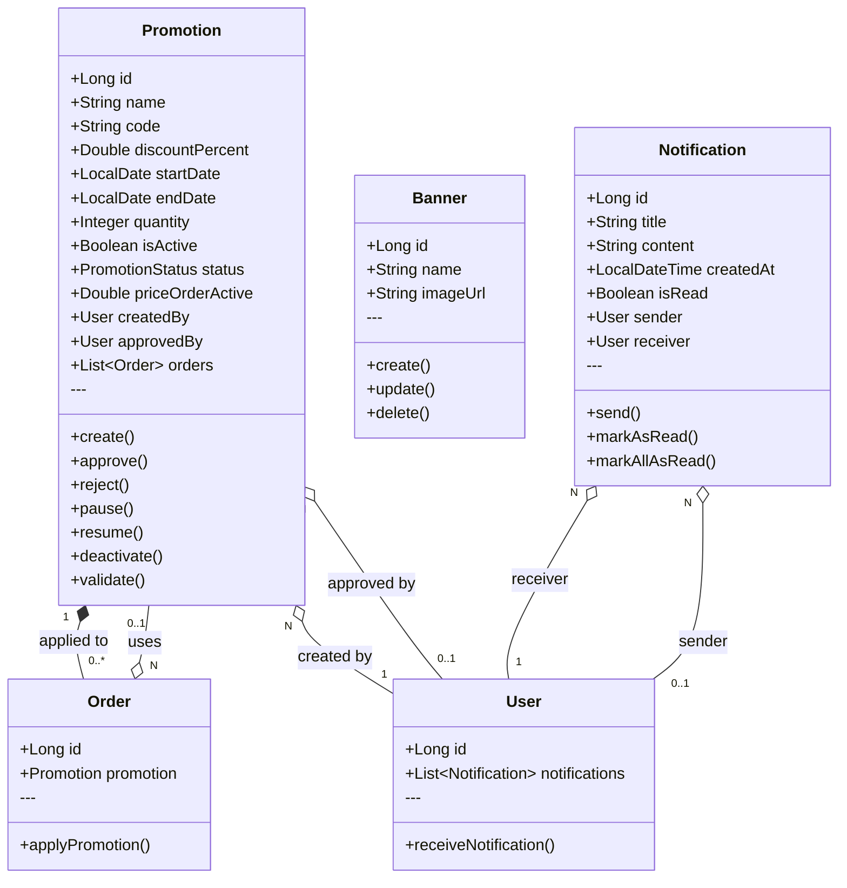
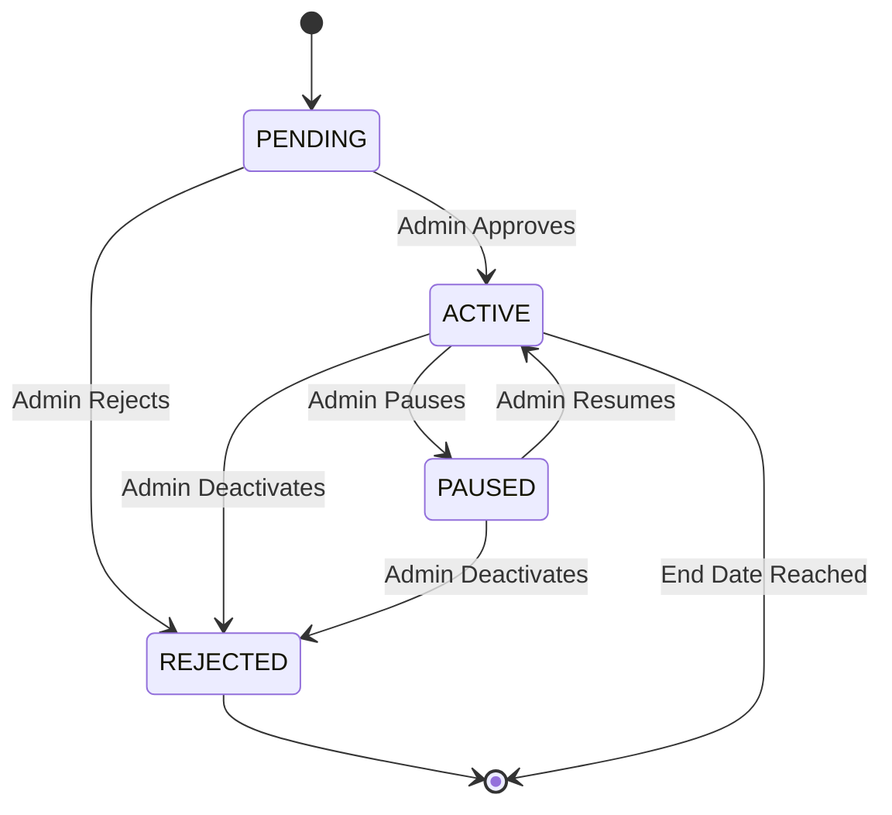

# Class Diagram - Marketing Domain

> **Document ID:** class-007
> **Phiên bản:** 1.0.0
> **Ngày:** 2026-04-25
> **Domain:** Marketing & Communication
> **Entities:** Promotion, Banner, Notification

---

## 1. Class Diagram

---

## 2. Promotion Status Flow

---

## 3. Notification Triggers

| Event | Notification Type | Recipient |
|-------|-------------------|-----------|
| Order created | Order placed | Customer |
| Order status changed | Status update | Customer |
| Payment received | Payment confirmed | Customer |
| Promotion created | Promotion pending | Admin |
| Promotion approved | Promotion active | Seller |
| Promotion paused | Promotion paused | All active users |
| Return request created | New return request | Seller |
| Return request approved | Return approved | Customer |
| Disposal request created | New disposal request | Admin |
| Stock request created | New stock request | Warehouse Staff |

---

## 4. Entity Details

### Promotion
| Field | Type | Constraints | Description |
|-------|------|-------------|-------------|
| id | Long | PK, AUTO | Primary key |
| name | String | NOT NULL | Promotion name |
| code | String | UNIQUE, NOT NULL | Promo code |
| discountPercent | Double | NOT NULL | % discount |
| startDate | LocalDate | NOT NULL | Start date |
| endDate | LocalDate | NOT NULL | End date |
| quantity | Integer | NOT NULL | Total codes available |
| status | PromotionStatus | NOT NULL | Status |
| priceOrderActive | Double | - | Min order value |

### Notification
| Field | Type | Constraints | Description |
|-------|------|-------------|-------------|
| id | Long | PK, AUTO | Primary key |
| title | String | NOT NULL | Notification title |
| content | String | TEXT | Message content |
| createdAt | LocalDateTime | NOT NULL | Created time |
| isRead | Boolean | NOT NULL | Read flag |

---

## 5. API Endpoints

### PromotionController (`/api/promotions`)
| Method | Endpoint | Auth | Description |
|--------|----------|------|-------------|
| POST | `/` | Yes | Create promotion |
| GET | `/search` | No | Search promotions |
| GET | `/validate/{code}` | No | Validate code |
| GET | `/` | No | Get all |
| GET | `/{id}` | No | Get by ID |
| PATCH | `/{id}/approve` | Admin | Approve |
| PATCH | `/{id}/deactivate` | Admin | Deactivate |
| PATCH | `/{id}/pause` | Admin | Pause |
| PATCH | `/{id}/resume` | Admin | Resume |
| POST | `/{id}/notify-paused` | Admin | Notify paused |
| POST | `/{id}/notify-customers` | Admin | Notify customers |
| POST | `/{id}/notify-resumed` | Admin | Notify resumed |

### BannerController (`/api/banners`)
| Method | Endpoint | Auth | Description |
|--------|----------|------|-------------|
| POST | `/` | Admin | Create banner |
| GET | `/` | No | Get all |
| GET | `/{id}` | No | Get by ID |
| PUT | `/{id}` | Admin | Update |
| DELETE | `/{id}` | Admin | Delete |

### NotificationController (`/api/notifications`)
| Method | Endpoint | Auth | Description |
|--------|----------|------|-------------|
| GET | `/` | Yes | Get my notifications |
| PATCH | `/{id}/read` | Yes | Mark as read |
| PATCH | `/read-all` | Yes | Mark all as read |
| GET | `/unread-count` | Yes | Get unread count |

---

## 6. Related Documents

- **ER Diagram:** `er-diagram/er-001-full.md`
- **Use Case:** `usecase/uc-008.md`
- **Sequence:** `sequence/seq-009.md`
- **State Machine:** `state/state-004-promotion.md`

---

*Generated by Senior BA Agent | BookStore Backend | 2026-04-25*
