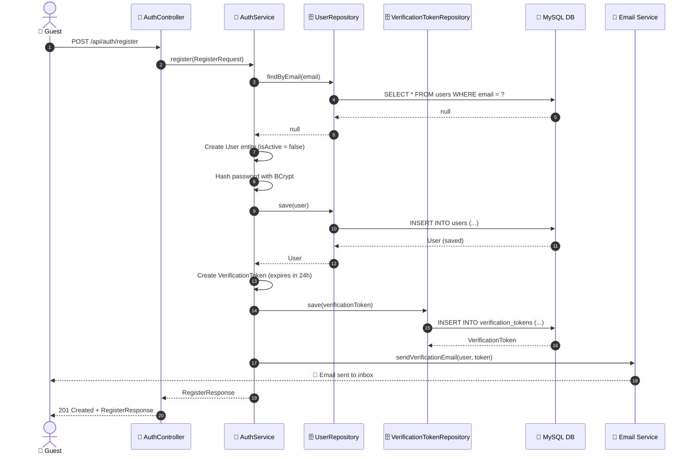
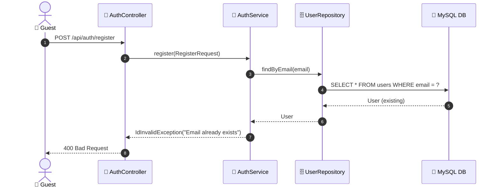

# SEQ-002a: Register

> **Sequence ID:** SEQ-002a
> **Maps to:** UC-002a
> **Phiên bản:** 1.0.0
> **Ngày:** 2026-04-25

---

## 1. Register

---

## 2. Register - Email Exists Error

---

*Generated by Senior BA Agent | BookStore Backend | 2026-04-25*
