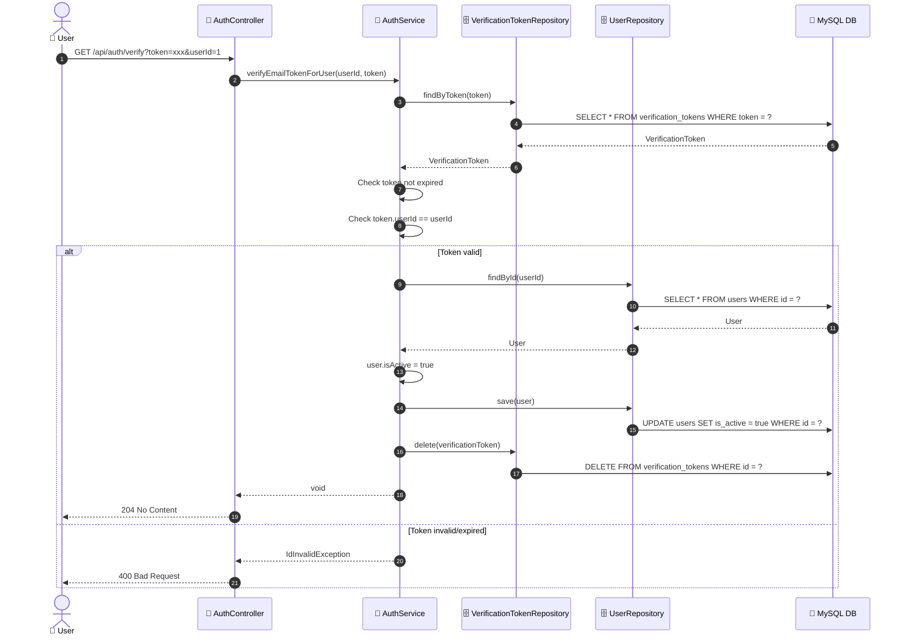
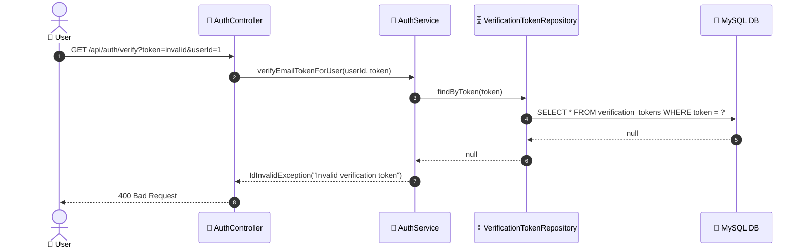

# SEQ-002b: Verify Email

> **Sequence ID:** SEQ-002b
> **Maps to:** UC-002b
> **Phiên bản:** 1.0.0
> **Ngày:** 2026-04-25

---

## 1. Verify Email - Success

---

## 2. Verify Email - Token Not Found

---

*Generated by Senior BA Agent | BookStore Backend | 2026-04-25*
