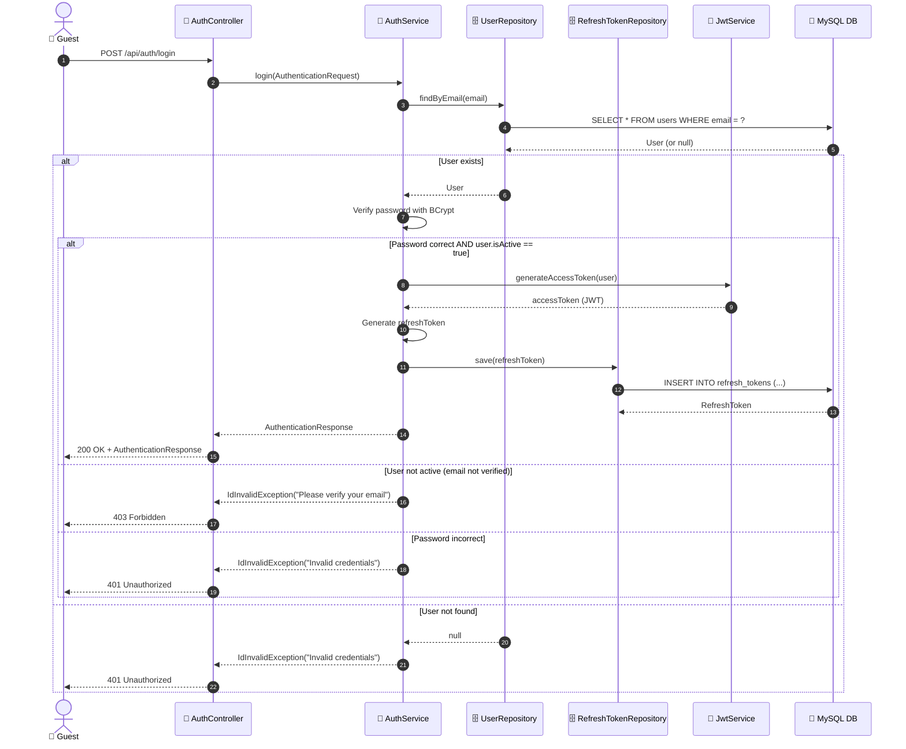
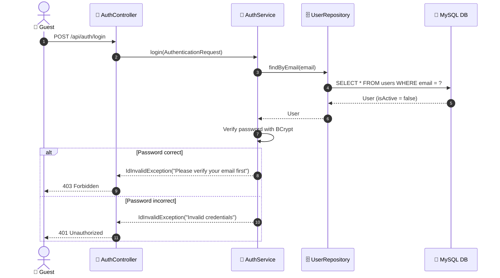

# SEQ-002c: Login

> **Sequence ID:** SEQ-002c
> **Maps to:** UC-002c
> **Phiên bản:** 1.0.0
> **Ngày:** 2026-04-25

---

## 1. Login - Success

---

## 2. Login - User Not Verified

---

*Generated by Senior BA Agent | BookStore Backend | 2026-04-25*
