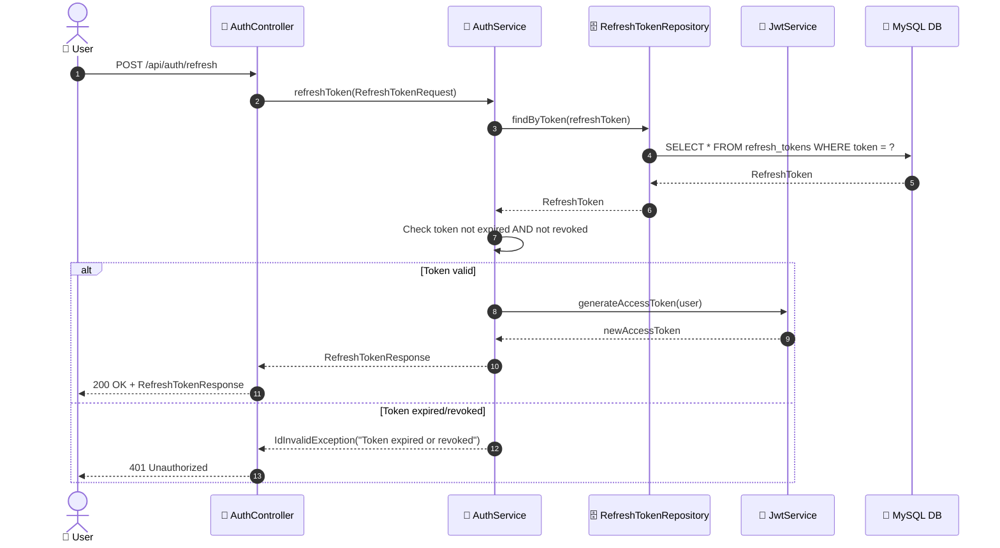
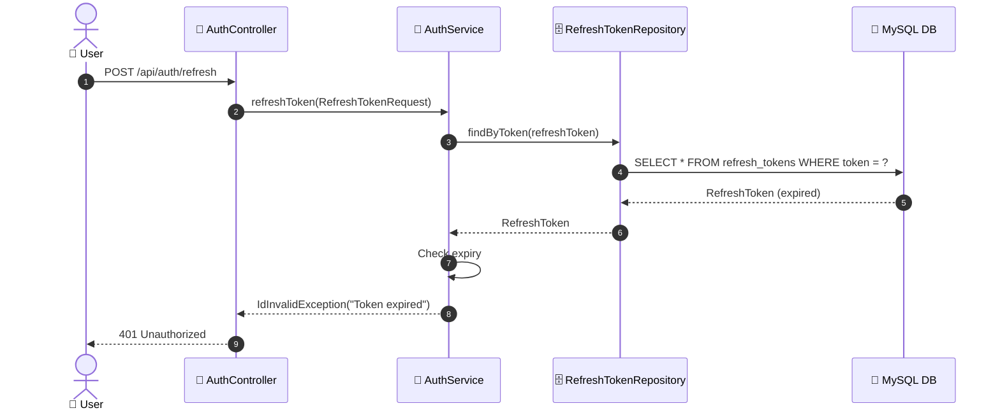

# SEQ-002d: Refresh Token

> **Sequence ID:** SEQ-002d
> **Maps to:** UC-002d
> **Phiên bản:** 1.0.0
> **Ngày:** 2026-04-25

---

## 1. Refresh Token - Success

---

## 2. Refresh Token - Token Expired

---

*Generated by Senior BA Agent | BookStore Backend | 2026-04-25*
