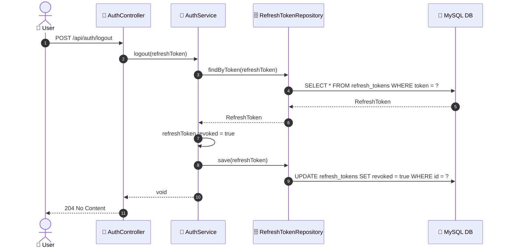
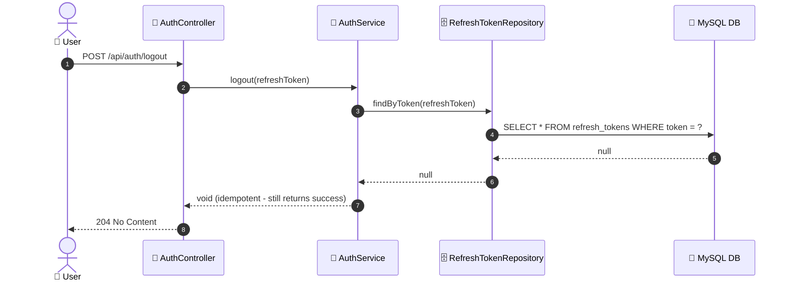

# SEQ-002e: Logout

> **Sequence ID:** SEQ-002e
> **Maps to:** UC-002e
> **Phiên bản:** 1.0.0
> **Ngày:** 2026-04-25

---

## 1. Logout - Success

---

## 2. Logout - Token Not Found (Idempotent)

---

*Generated by Senior BA Agent | BookStore Backend | 2026-04-25*
