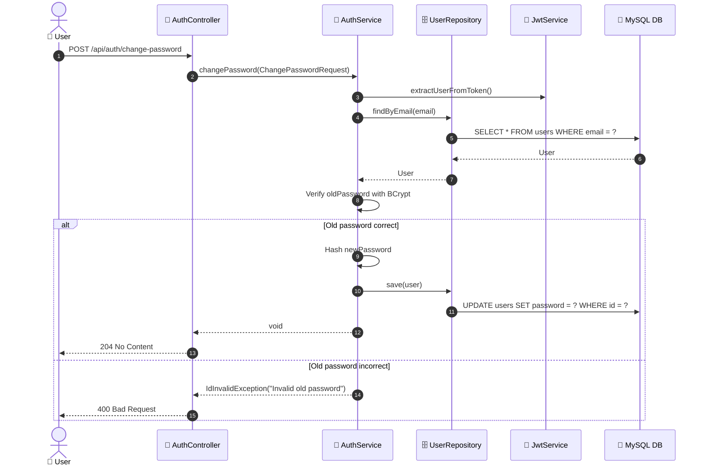
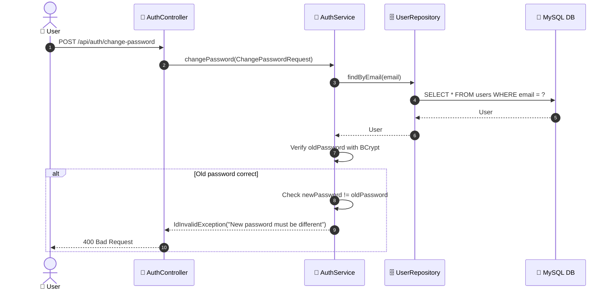

# SEQ-002f: Change Password

> **Sequence ID:** SEQ-002f
> **Maps to:** UC-002f
> **Phiên bản:** 1.0.0
> **Ngày:** 2026-04-25

---

## 1. Change Password - Success

---

## 2. Change Password - New Password Same as Old

---

*Generated by Senior BA Agent | BookStore Backend | 2026-04-25*
