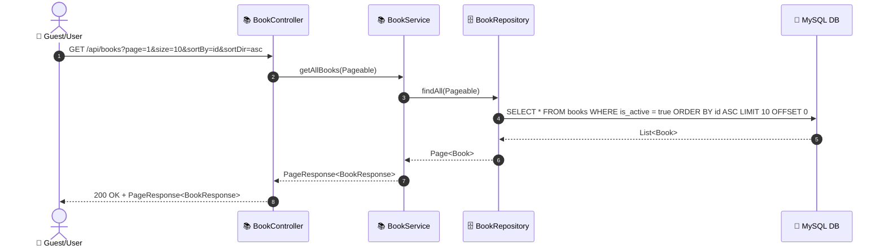
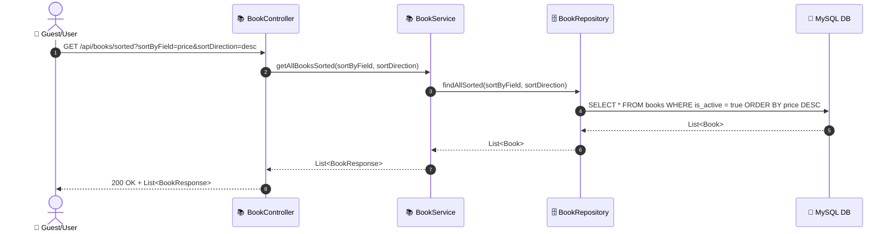
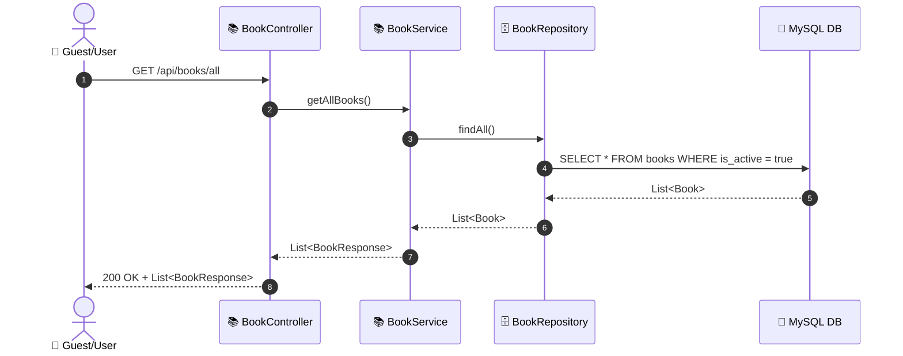

# SEQ-001a: Browse All Books

> **Sequence ID:** SEQ-001a
> **Maps to:** UC-001a
> **Phiên bản:** 1.0.0
> **Ngày:** 2026-04-25

---

## 1. Browse All Books (Paginated)

---

## 2. Browse All Books (Sorted)

---

## 3. Browse All Books Without Pagination

---

*Generated by Senior BA Agent | BookStore Backend | 2026-04-25*
