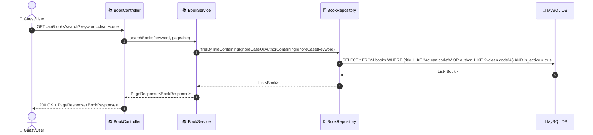
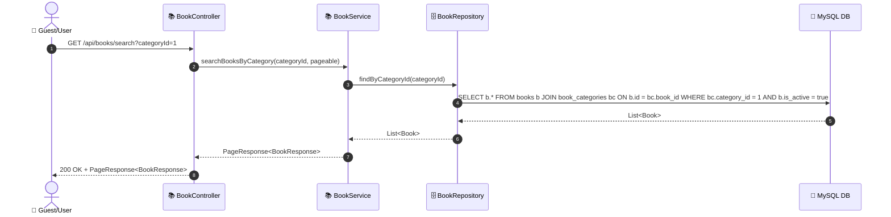
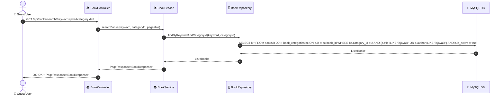
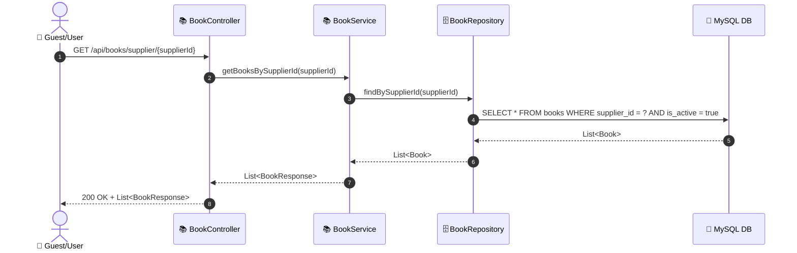

# SEQ-001b: Search Books

> **Sequence ID:** SEQ-001b
> **Maps to:** UC-001b
> **Phiên bản:** 1.0.0
> **Ngày:** 2026-04-25

---

## 1. Search Books by Keyword

---

## 2. Search Books by Category

---

## 3. Search Books Combined (Keyword + Category)

---

## 4. Search Books by Supplier

---

*Generated by Senior BA Agent | BookStore Backend | 2026-04-25*
