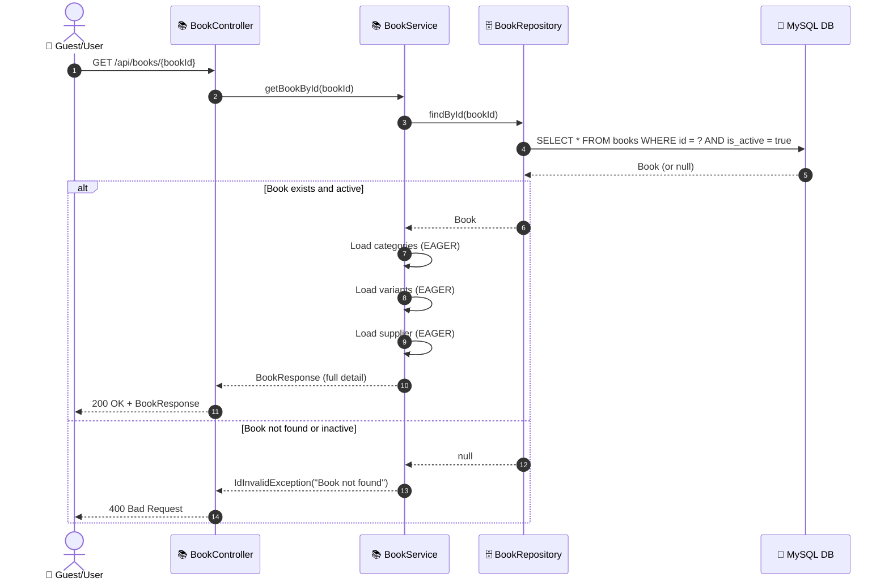
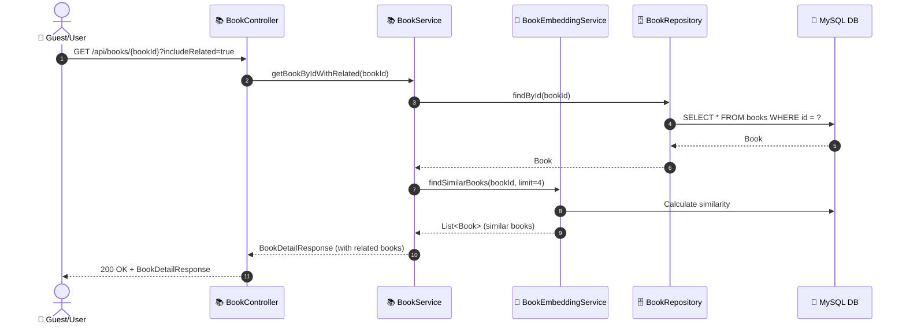

# SEQ-001c: View Book Detail

> **Sequence ID:** SEQ-001c
> **Maps to:** UC-001c
> **Phiên bản:** 1.0.0
> **Ngày:** 2026-04-25

---

## 1. Get Book Detail

---

## 2. Get Book Detail with Related Books

---

*Generated by Senior BA Agent | BookStore Backend | 2026-04-25*
