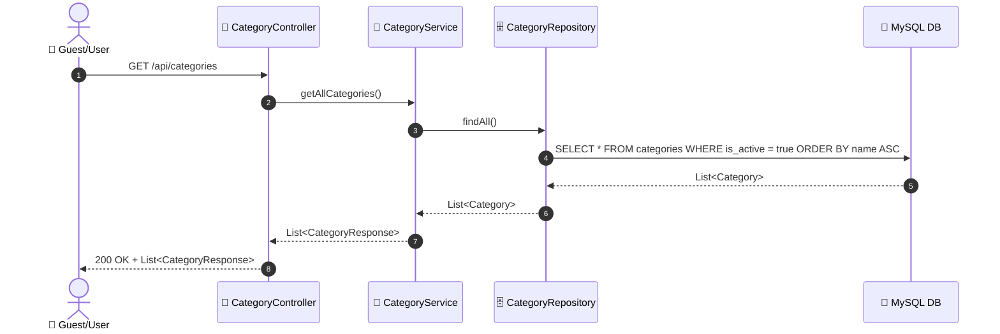
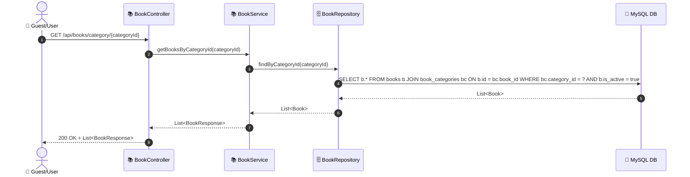
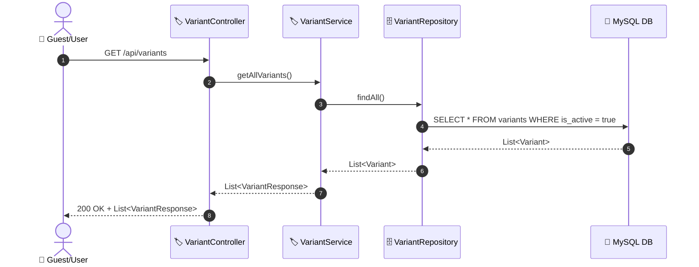
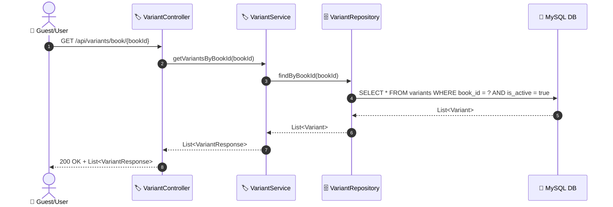

# SEQ-001d: Filter by Category

> **Sequence ID:** SEQ-001d
> **Maps to:** UC-001d
> **Phiên bản:** 1.0.0
> **Ngày:** 2026-04-25

---

## 1. Browse All Categories

---

## 2. Get Books by Category

---

## 3. Browse Variants (Formats)

---

## 4. Get Variants by Book

---

*Generated by Senior BA Agent | BookStore Backend | 2026-04-25*
