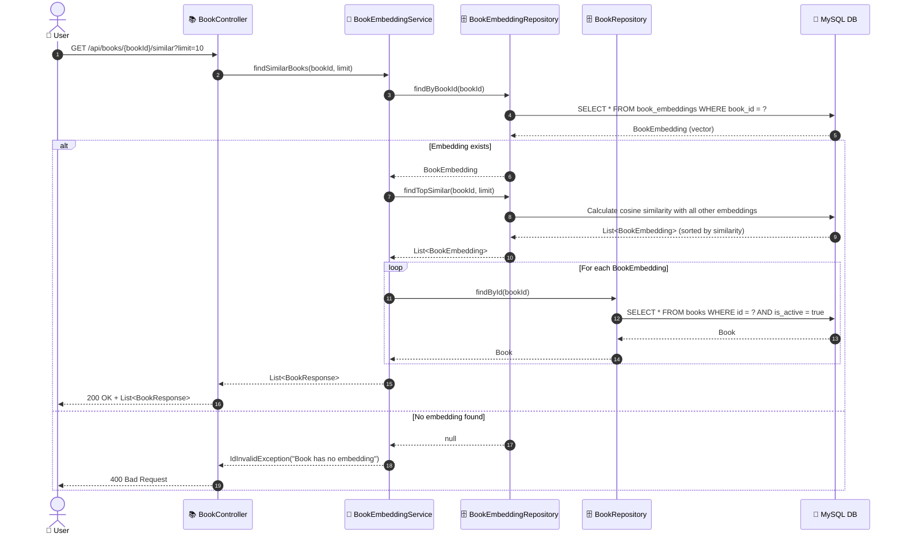
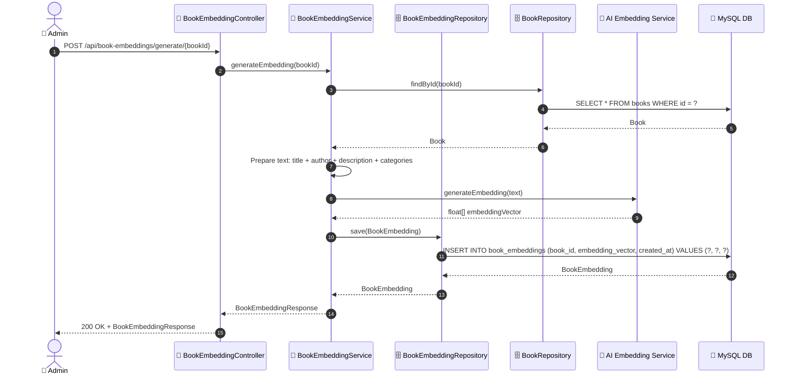

# SEQ-001e: Find Similar Books (AI)

> **Sequence ID:** SEQ-001e
> **Maps to:** UC-001e
> **Phiên bản:** 1.0.0
> **Ngày:** 2026-04-25

---

## 1. Find Similar Books

---

## 2. Generate/Update Book Embedding

---

*Generated by Senior BA Agent | BookStore Backend | 2026-04-25*
