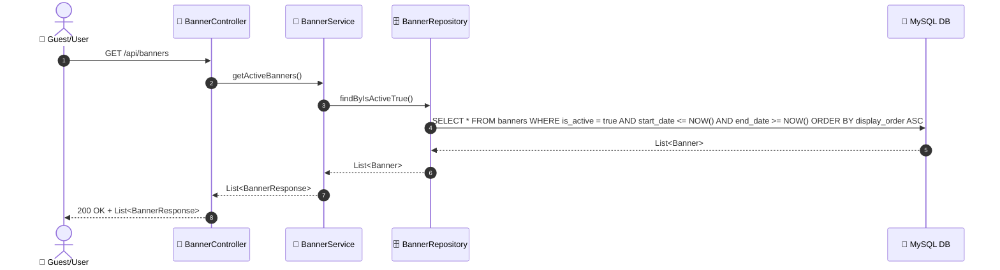
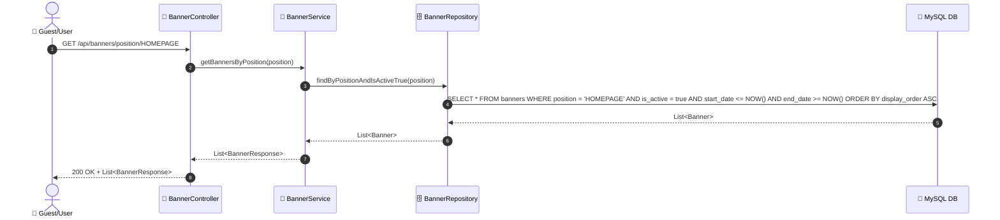
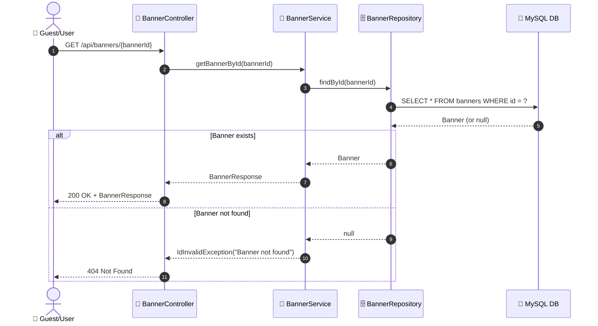

# SEQ-001f: Browse Banners

> **Sequence ID:** SEQ-001f
> **Maps to:** UC-001f
> **Phiên bản:** 1.0.0
> **Ngày:** 2026-04-25

---

## 1. Browse All Active Banners

---

## 2. Browse Banners by Position

---

## 3. Get Banner Detail

---

*Generated by Senior BA Agent | BookStore Backend | 2026-04-25*
