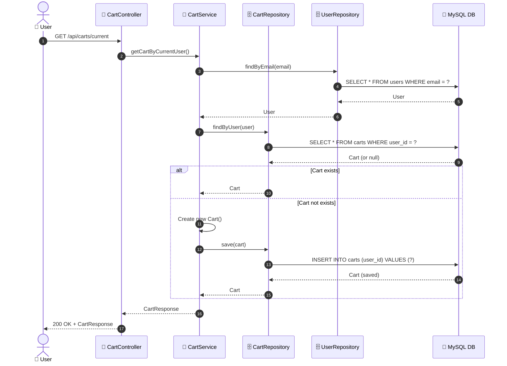

# SEQ-003a: View Cart

> **Sequence ID:** SEQ-003a
> **Maps to:** UC-003a
> **Phiên bản:** 1.0.0
> **Ngày:** 2026-04-25

---

## 1. Get Cart (Auto-Create if Not Exists)

---

*Generated by Senior BA Agent | BookStore Backend | 2026-04-25*
