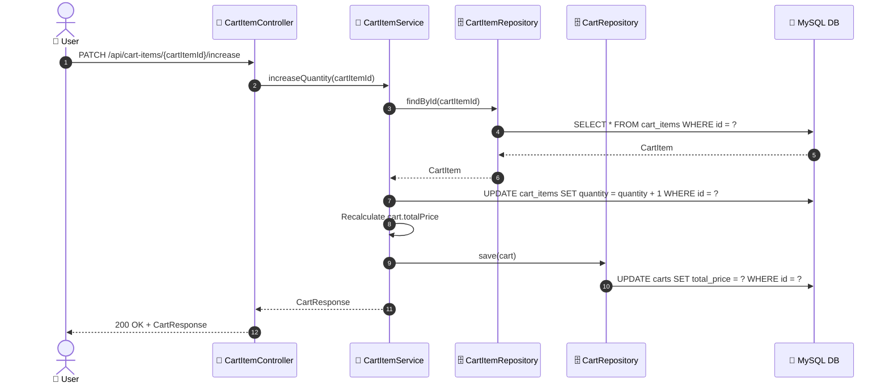
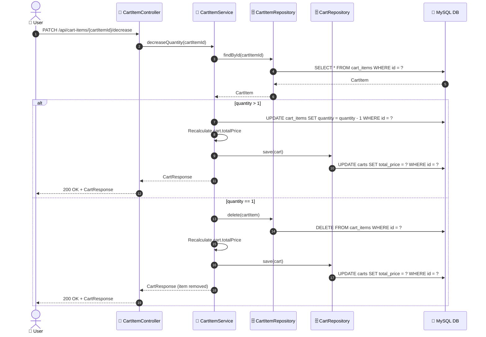
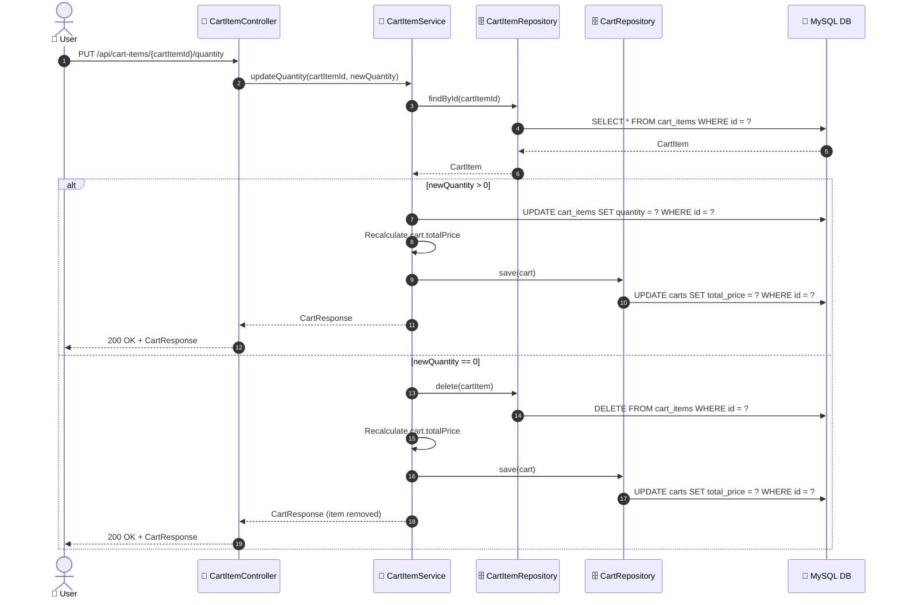

# SEQ-003c: Update Quantity

> **Sequence ID:** SEQ-003c
> **Maps to:** UC-003c
> **Phiên bản:** 1.0.0
> **Ngày:** 2026-04-25

---

## 1. Increase Quantity

---

## 2. Decrease Quantity

---

## 3. Set Quantity (Direct Update)

---

*Generated by Senior BA Agent | BookStore Backend | 2026-04-25*
