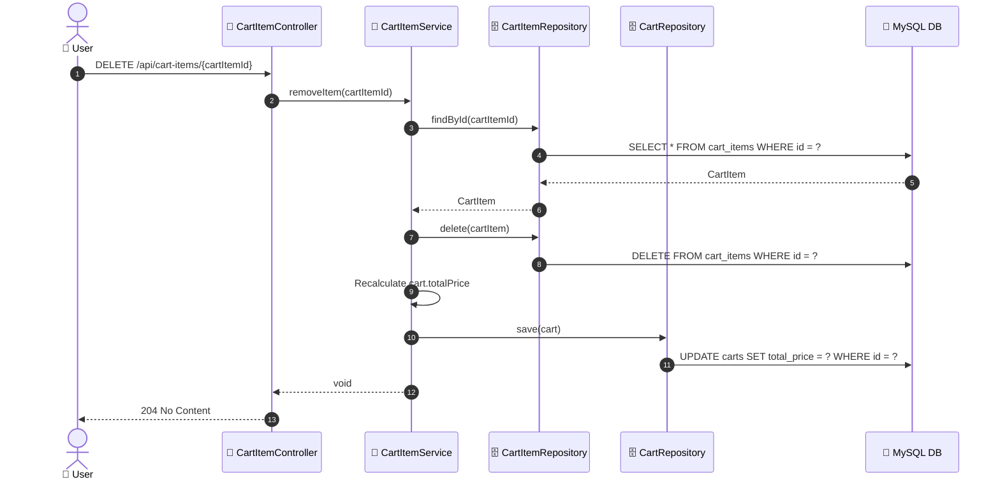

# SEQ-003d: Remove Item

> **Sequence ID:** SEQ-003d
> **Maps to:** UC-003d
> **Phiên bản:** 1.0.0
> **Ngày:** 2026-04-25

---

## 1. Remove Item from Cart

---

*Generated by Senior BA Agent | BookStore Backend | 2026-04-25*
