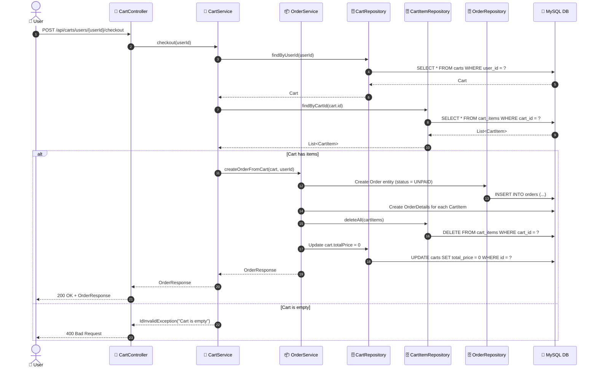

# SEQ-003f: Checkout

> **Sequence ID:** SEQ-003f
> **Maps to:** UC-003f
> **Phiên bản:** 1.0.0
> **Ngày:** 2026-04-25

---

## 1. Checkout

---

*Generated by Senior BA Agent | BookStore Backend | 2026-04-25*
