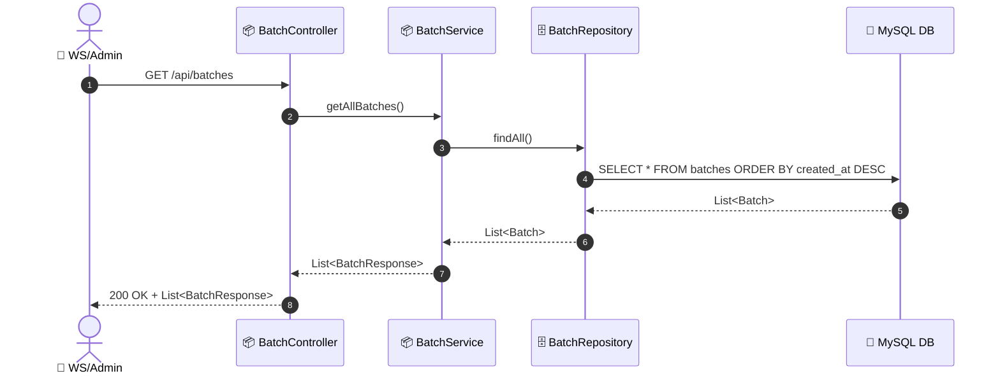
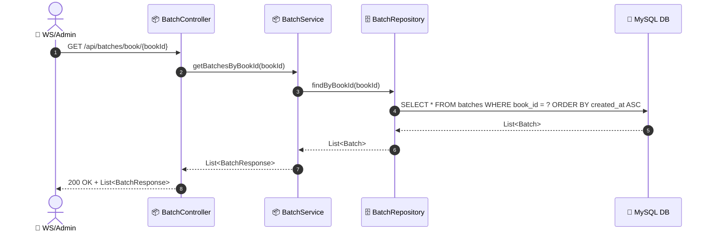
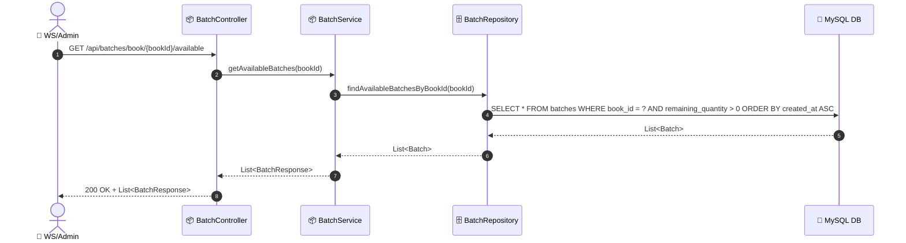

# SEQ-006a: View Batches

> **Sequence ID:** SEQ-006a
> **Maps to:** UC-006a
> **Phiên bản:** 1.0.0
> **Ngày:** 2026-04-25

---

## 1. View All Batches

---

## 2. View Batches by Book

---

## 3. Get Available Batches (FIFO)

---

*Generated by Senior BA Agent | BookStore Backend | 2026-04-25*
