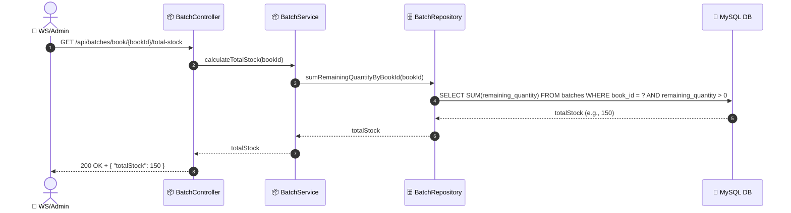

# SEQ-006c: Calculate Total Stock

> **Sequence ID:** SEQ-006c
> **Maps to:** UC-006c
> **Phiên bản:** 1.0.0
> **Ngày:** 2026-04-25

---

## 1. Calculate Total Stock

---

*Generated by Senior BA Agent | BookStore Backend | 2026-04-25*
