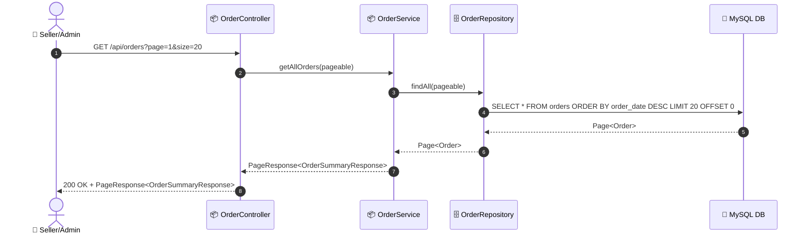

# SEQ-005a: View All Orders

> **Sequence ID:** SEQ-005a
> **Maps to:** UC-005a
> **Phiên bản:** 1.0.0
> **Ngày:** 2026-04-25

---

## 1. View All Orders

---

*Generated by Senior BA Agent | BookStore Backend | 2026-04-25*
