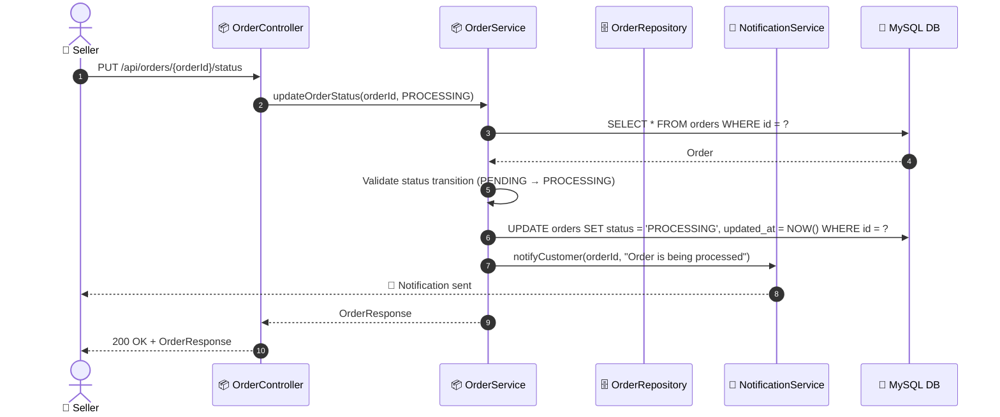
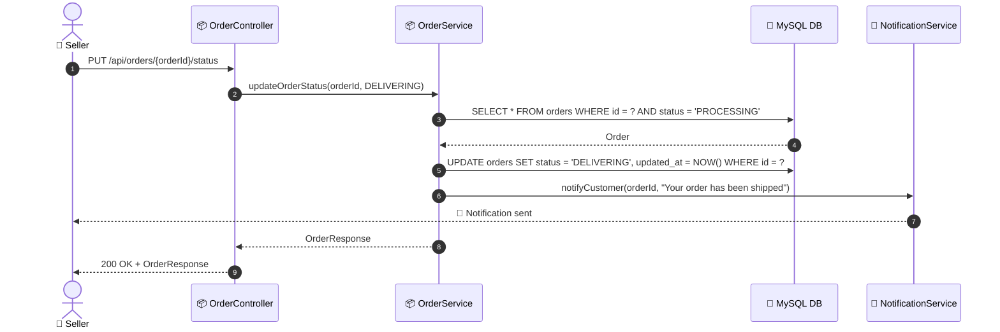

# SEQ-005b: Update Order Status

> **Sequence ID:** SEQ-005b
> **Maps to:** UC-005b
> **Phiên bản:** 1.0.0
> **Ngày:** 2026-04-25

---

## 1. Update Order Status (PENDING → PROCESSING)

---

## 2. Update Order Status (PROCESSING → DELIVERING)

---

*Generated by Senior BA Agent | BookStore Backend | 2026-04-25*
