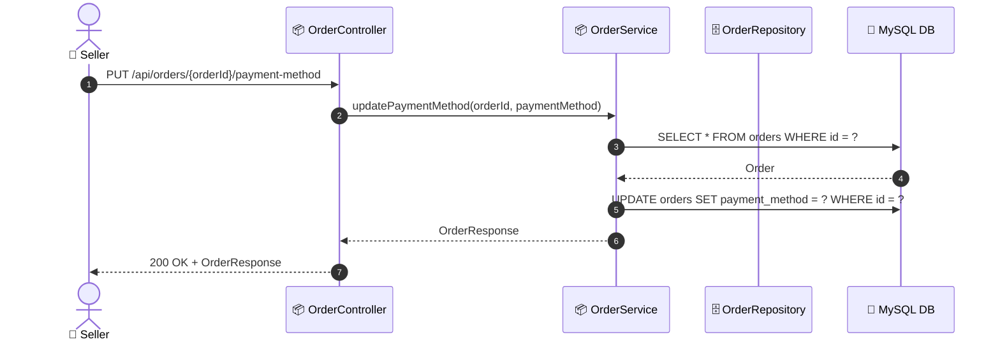

# SEQ-005c: Update Payment Method

> **Sequence ID:** SEQ-005c
> **Maps to:** UC-005c
> **Phiên bản:** 1.0.0
> **Ngày:** 2026-04-25

---

## 1. Update Payment Method

---

*Generated by Senior BA Agent | BookStore Backend | 2026-04-25*
