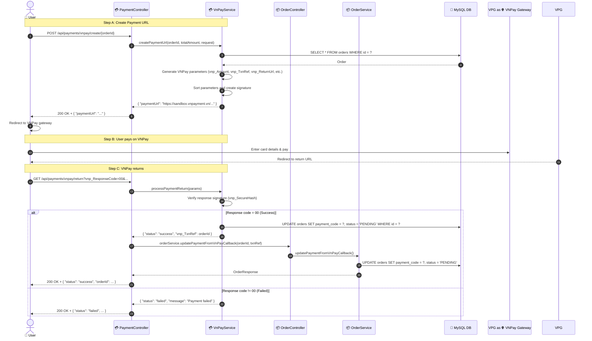

# SEQ-004b: Pay by VNPay

> **Sequence ID:** SEQ-004b
> **Maps to:** UC-004b
> **Phiên bản:** 1.0.0
> **Ngày:** 2026-04-25

---

## 1. Pay by VNPay - Full Flow

---

*Generated by Senior BA Agent | BookStore Backend | 2026-04-25*
