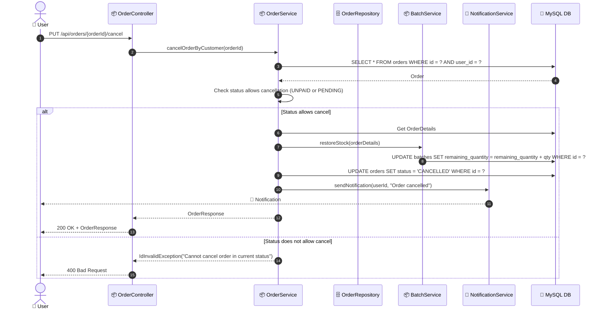

# SEQ-004d: Cancel Order

> **Sequence ID:** SEQ-004d
> **Maps to:** UC-004d
> **Phiên bản:** 1.0.0
> **Ngày:** 2026-04-25

---

## 1. Cancel Order

---

*Generated by Senior BA Agent | BookStore Backend | 2026-04-25*
