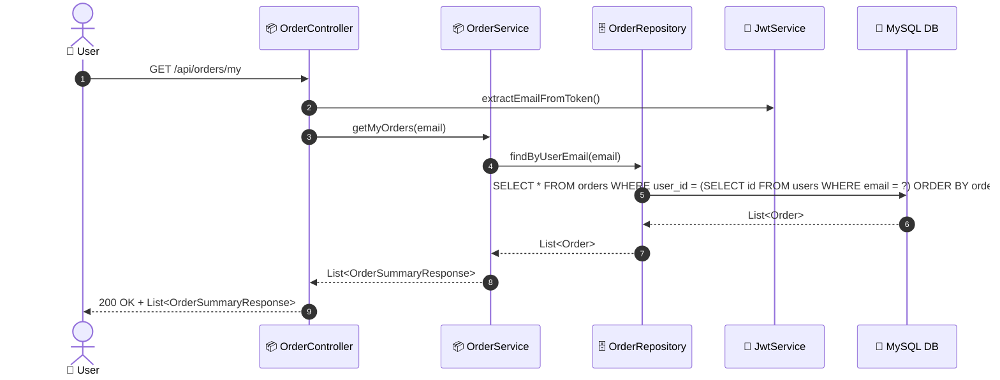

# SEQ-004e: View My Orders

> **Sequence ID:** SEQ-004e
> **Maps to:** UC-004e
> **Phiên bản:** 1.0.0
> **Ngày:** 2026-04-25

---

## 1. View My Orders

---

*Generated by Senior BA Agent | BookStore Backend | 2026-04-25*
