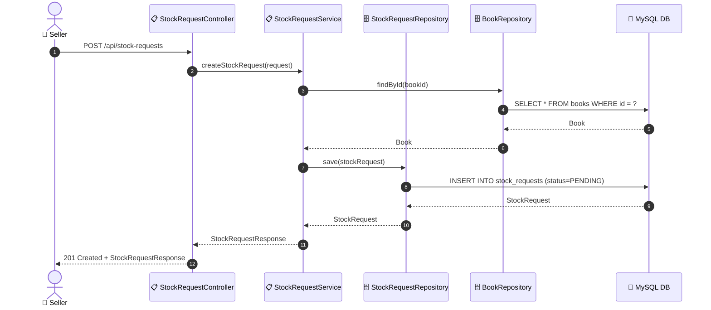

# SEQ-010a: Create Stock Request

> **Sequence ID:** SEQ-010a
> **Maps to:** UC-010a
> **Phiên bản:** 1.0.0
> **Ngày:** 2026-04-25

---

## 1. Create Stock Request

---

*Generated by Senior BA Agent | BookStore Backend | 2026-04-25*
