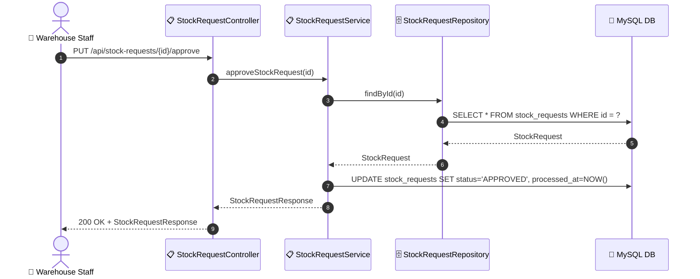
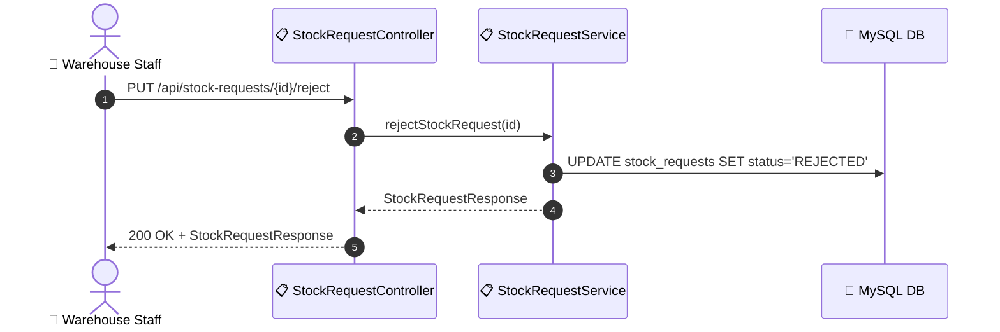

# SEQ-010b: Approve/Reject Stock Request

> **Sequence ID:** SEQ-010b
> **Maps to:** UC-010b
> **Phiên bản:** 1.0.0
> **Ngày:** 2026-04-25

---

## 1. Approve Stock Request

---

## 2. Reject Stock Request

---

*Generated by Senior BA Agent | BookStore Backend | 2026-04-25*
