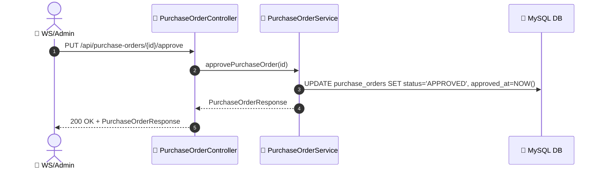
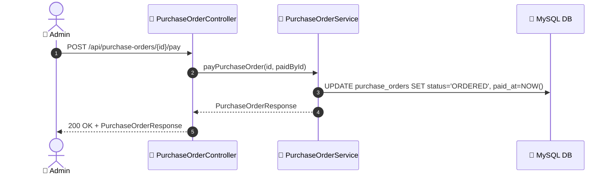

# SEQ-010d: Approve & Pay Purchase Order

> **Sequence ID:** SEQ-010d
> **Maps to:** UC-010d
> **Phiên bản:** 1.0.0
> **Ngày:** 2026-04-25

---

## 1. Approve Purchase Order

---

## 2. Pay Purchase Order

---

*Generated by Senior BA Agent | BookStore Backend | 2026-04-25*
