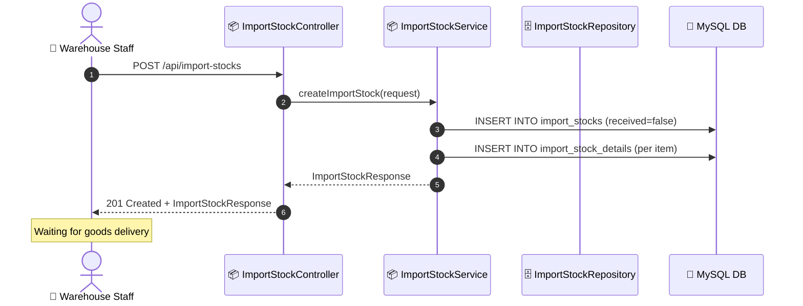

# SEQ-010e: Create Import Stock

> **Sequence ID:** SEQ-010e
> **Maps to:** UC-010e
> **Phiên bản:** 1.0.0
> **Ngày:** 2026-04-25

---

## 1. Create Import Stock

---

*Generated by Senior BA Agent | BookStore Backend | 2026-04-25*
