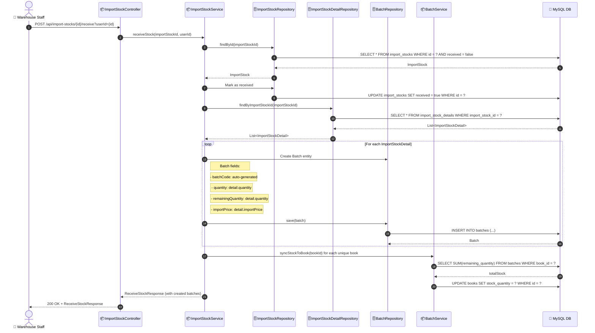

# SEQ-010f: Receive Stock (Create Batch)

> **Sequence ID:** SEQ-010f
> **Maps to:** UC-010f
> **Phiên bản:** 1.0.0
> **Ngày:** 2026-04-25

---

## 1. Receive Stock

---

*Generated by Senior BA Agent | BookStore Backend | 2026-04-25*
