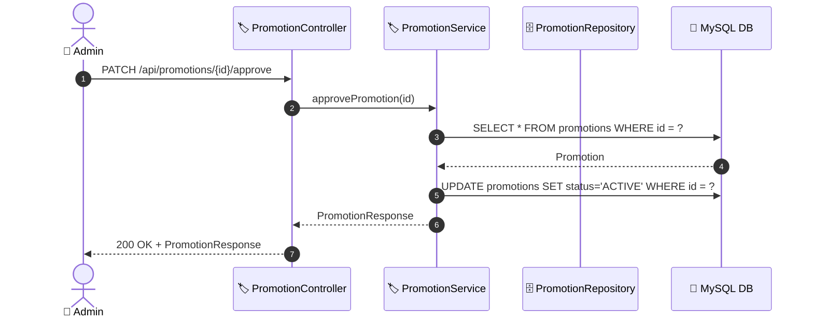
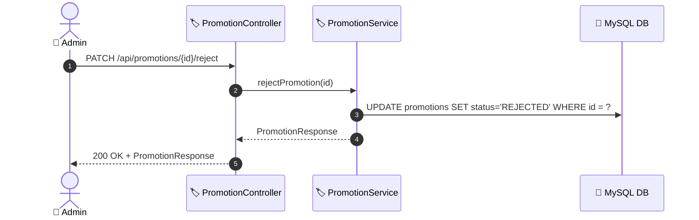

# SEQ-008b: Approve/Reject Promotion

> **Sequence ID:** SEQ-008b
> **Maps to:** UC-008b
> **Phiên bản:** 1.0.0
> **Ngày:** 2026-04-25

---

## 1. Approve Promotion

---

## 2. Reject Promotion

---

*Generated by Senior BA Agent | BookStore Backend | 2026-04-25*
