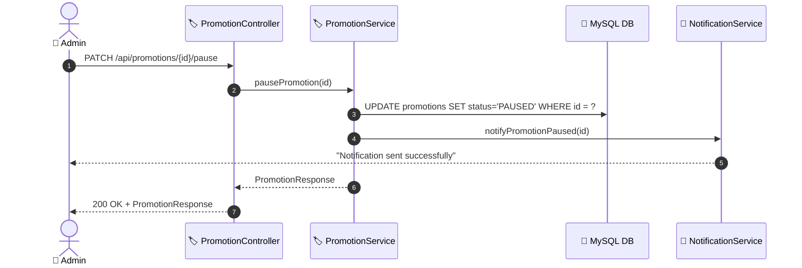
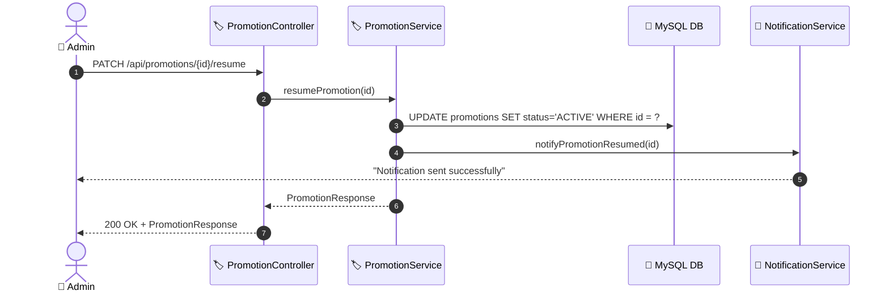

# SEQ-008c: Pause/Resume Promotion

> **Sequence ID:** SEQ-008c
> **Maps to:** UC-008c
> **Phiên bản:** 1.0.0
> **Ngày:** 2026-04-25

---

## 1. Pause Promotion

---

## 2. Resume Promotion

---

*Generated by Senior BA Agent | BookStore Backend | 2026-04-25*
