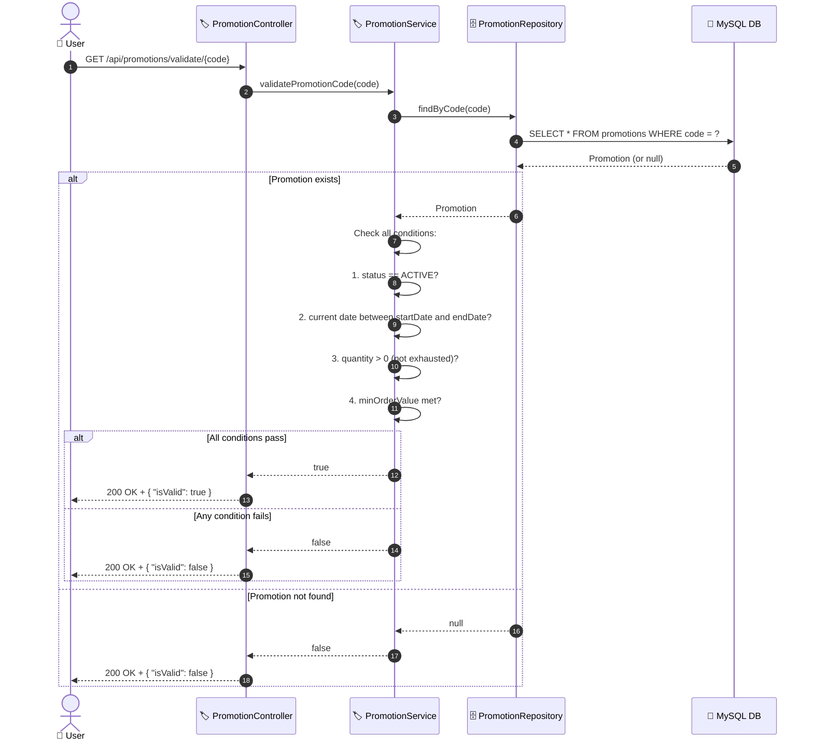

# SEQ-008d: Validate Promo Code

> **Sequence ID:** SEQ-008d
> **Maps to:** UC-008d
> **Phiên bản:** 1.0.0
> **Ngày:** 2026-04-25

---

## 1. Validate Promo Code

---

*Generated by Senior BA Agent | BookStore Backend | 2026-04-25*
