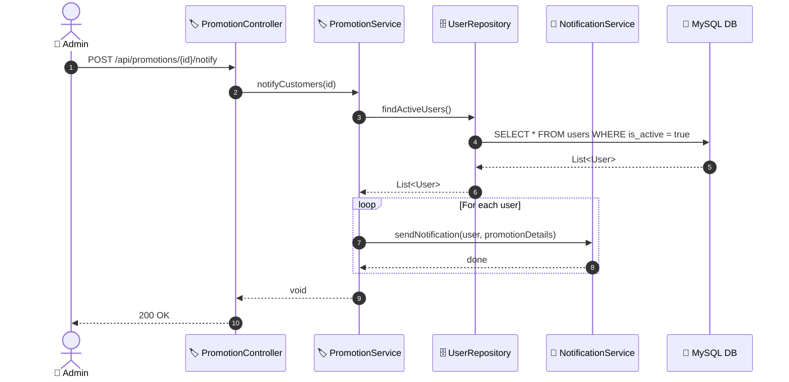

# SEQ-008e: Notify Customers

> **Sequence ID:** SEQ-008e
> **Maps to:** UC-008e
> **Phiên bản:** 1.0.0
> **Ngày:** 2026-04-25

---

## 1. Notify Customers

---

*Generated by Senior BA Agent | BookStore Backend | 2026-04-25*
