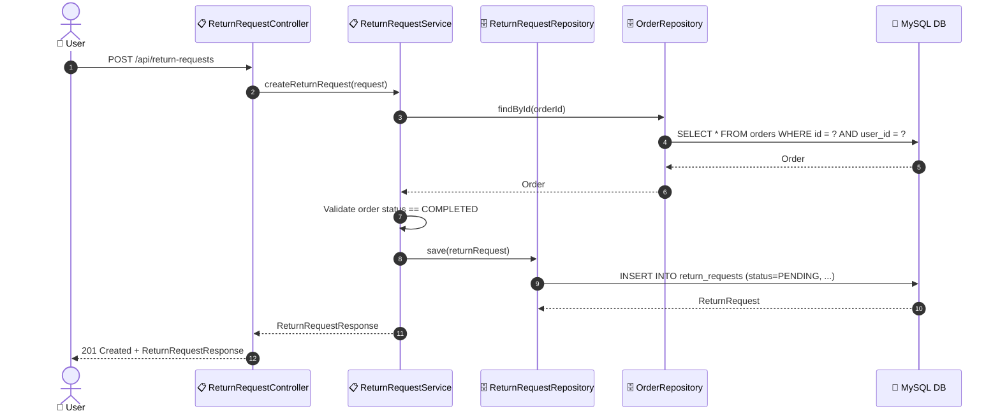

# SEQ-007a: Create Return Request

> **Sequence ID:** SEQ-007a
> **Maps to:** UC-007a
> **Phiên bản:** 1.0.0
> **Ngày:** 2026-04-25

---

## 1. Create Return Request

---

*Generated by Senior BA Agent | BookStore Backend | 2026-04-25*
