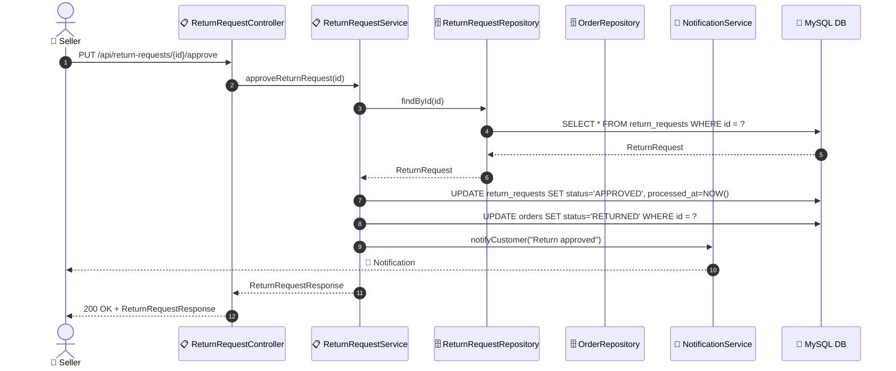
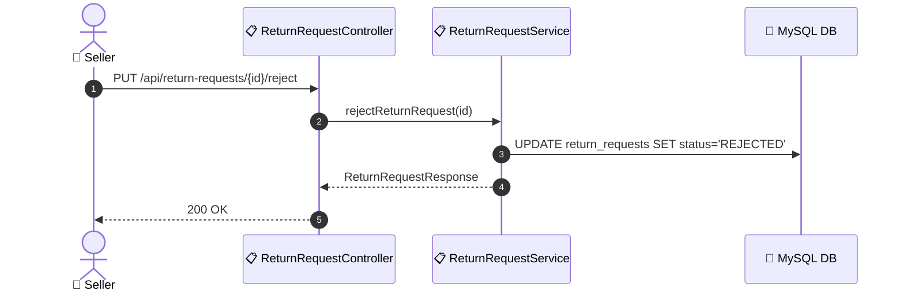

# SEQ-007b: Approve/Reject Return

> **Sequence ID:** SEQ-007b
> **Maps to:** UC-007b
> **Phiên bản:** 1.0.0
> **Ngày:** 2026-04-25

---

## 1. Approve Return Request

---

## 2. Reject Return Request

---

*Generated by Senior BA Agent | BookStore Backend | 2026-04-25*
