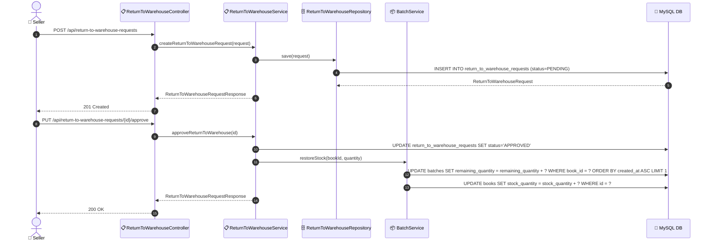

# SEQ-007c: Return to Warehouse

> **Sequence ID:** SEQ-007c
> **Maps to:** UC-007c
> **Phiên bản:** 1.0.0
> **Ngày:** 2026-04-25

---

## 1. Return to Warehouse

---

*Generated by Senior BA Agent | BookStore Backend | 2026-04-25*
