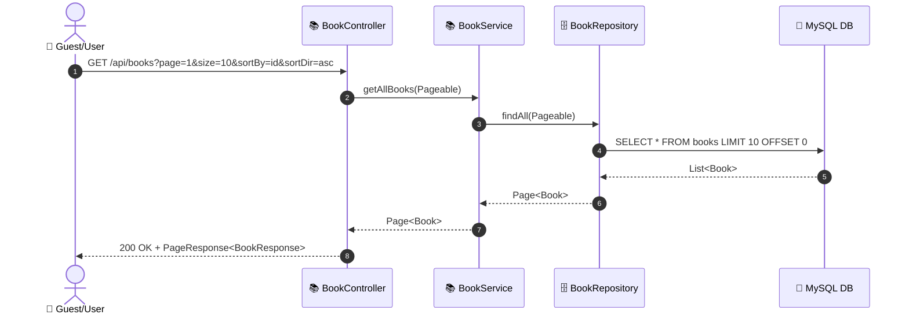
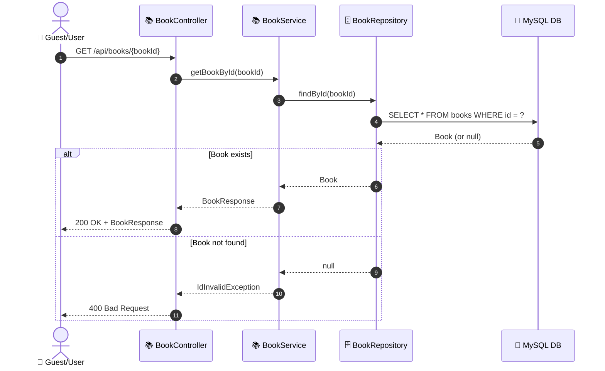
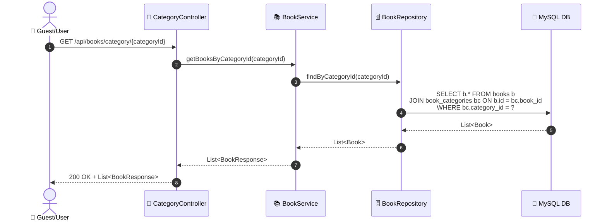
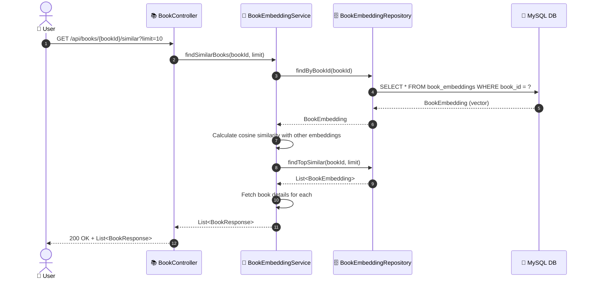
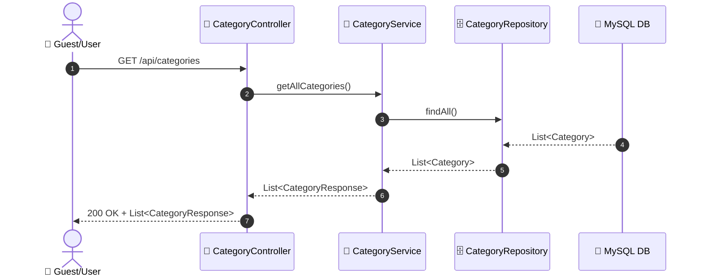

# SEQ-001: Browse & Search Books

> **Sequence ID:** SEQ-001
> **Maps to:** UC-001
> **Phiên bản:** 1.0.0
> **Ngày:** 2026-04-25

---

## 1. Browse All Books (Paginated)

---

## 2. Get Book Detail

---

## 3. Get Books by Category

---

## 4. Find Similar Books (AI)

---

## 5. Browse Categories

---

*Generated by Senior BA Agent | BookStore Backend | 2026-04-25*
