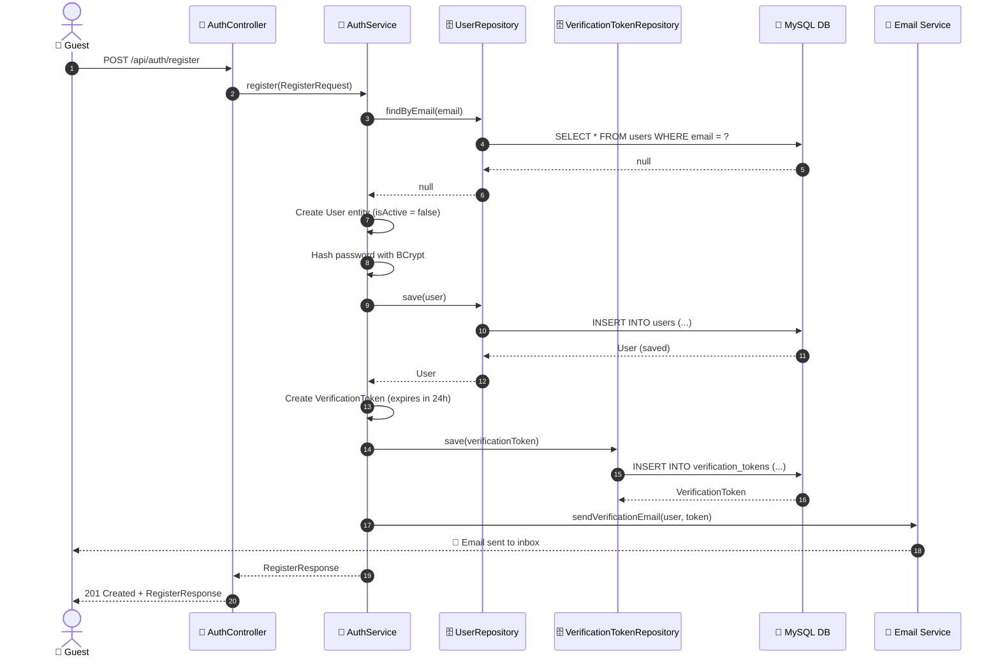
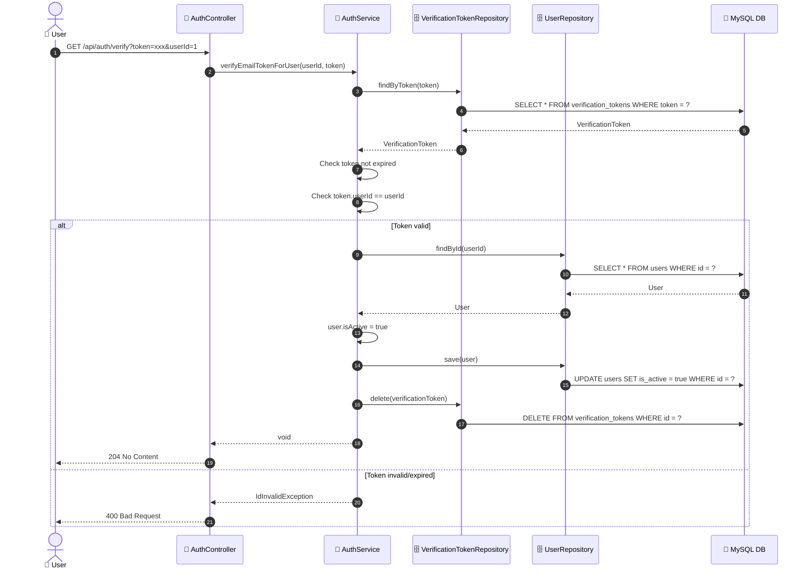
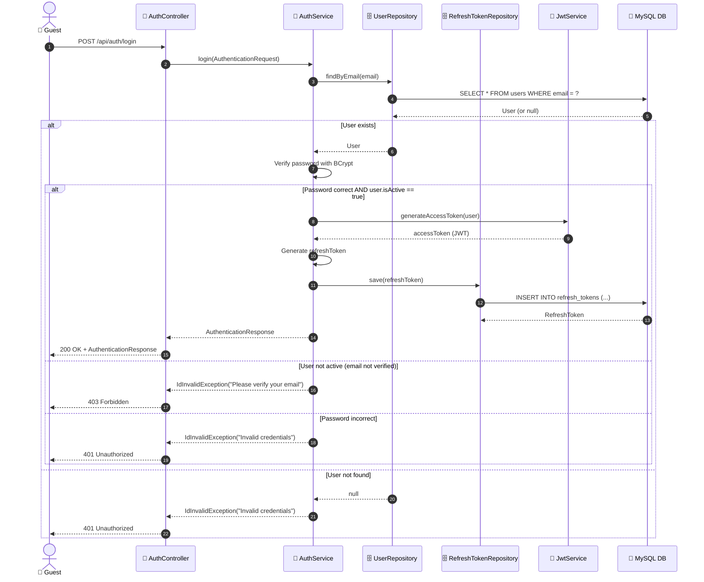
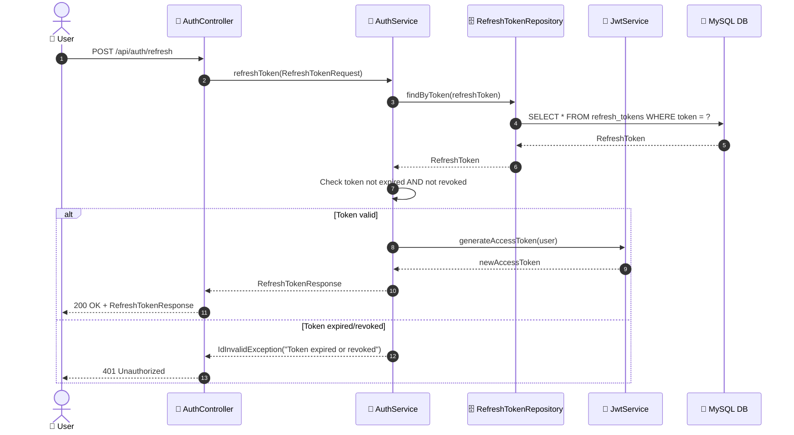
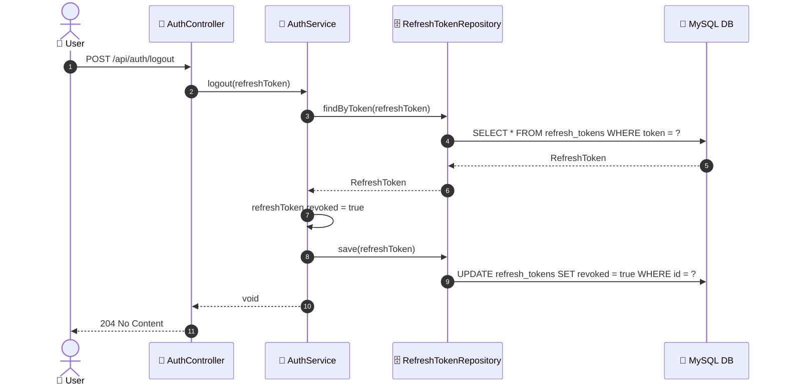
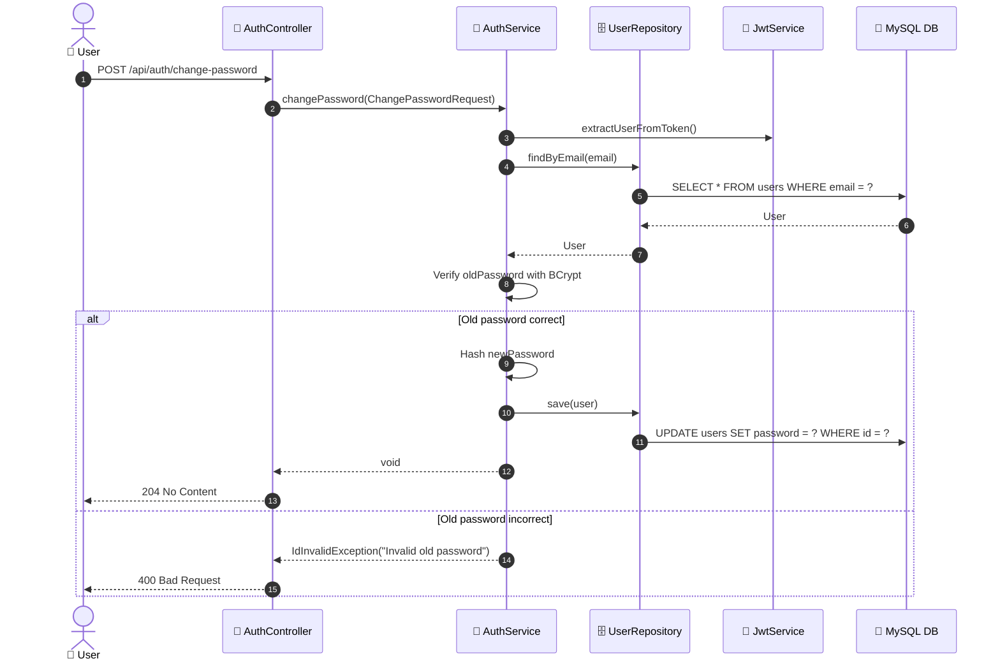

# SEQ-002: Register & Login

> **Sequence ID:** SEQ-002
> **Maps to:** UC-002
> **Phiên bản:** 1.0.0
> **Ngày:** 2026-04-25

---

## 1. Register

---

## 2. Verify Email

---

## 3. Login

---

## 4. Refresh Token

---

## 5. Logout

---

## 6. Change Password

---

*Generated by Senior BA Agent | BookStore Backend | 2026-04-25*
