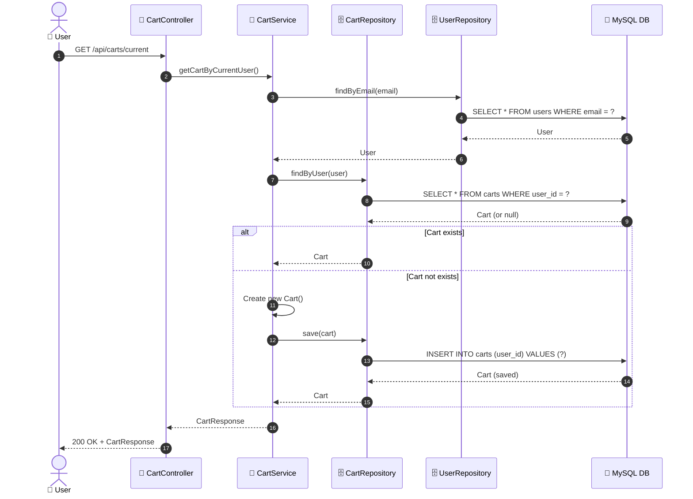
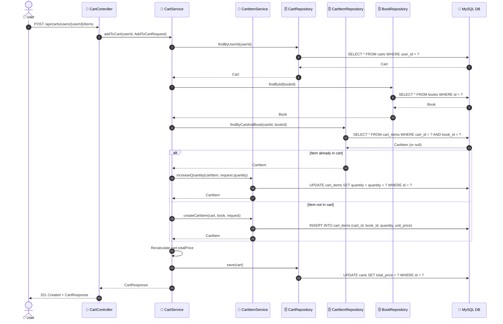
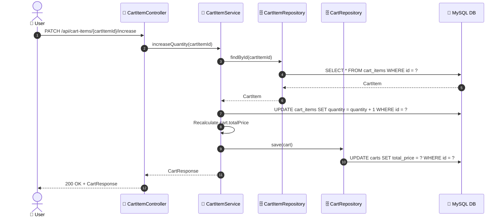
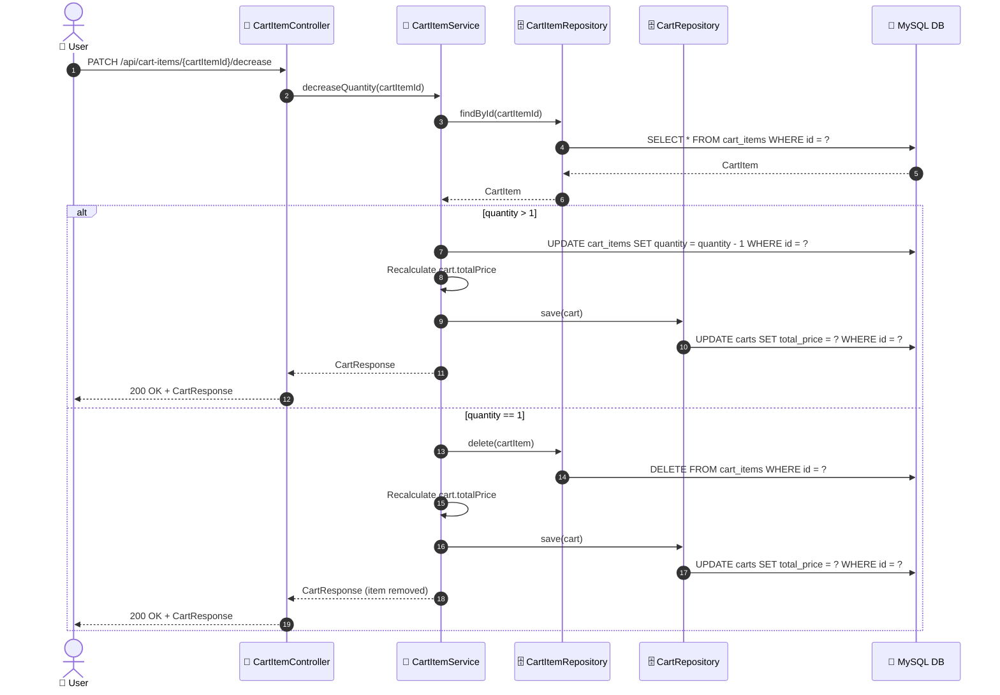
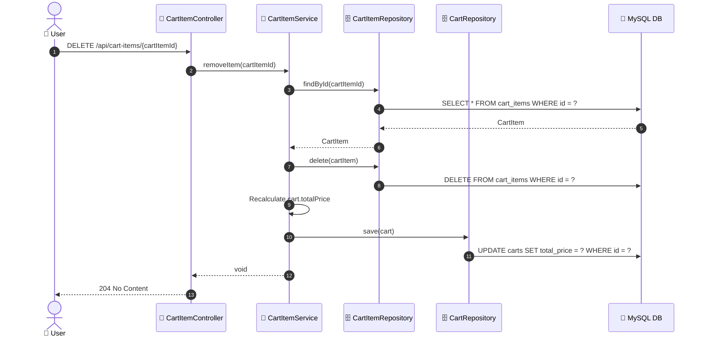
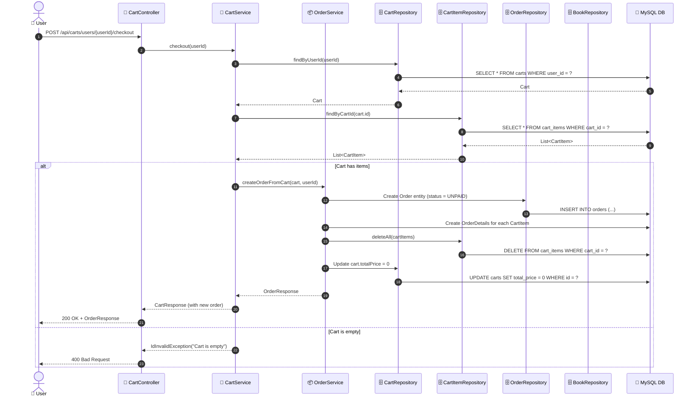

# SEQ-003: Add to Cart

> **Sequence ID:** SEQ-003
> **Maps to:** UC-003
> **Phiên bản:** 1.0.0
> **Ngày:** 2026-04-25

---

## 1. Get Cart (Auto-Create if Not Exists)

---

## 2. Add Item to Cart

---

## 3. Increase Quantity

---

## 4. Decrease Quantity

---

## 5. Remove Item

---

## 6. Checkout

---

*Generated by Senior BA Agent | BookStore Backend | 2026-04-25*
