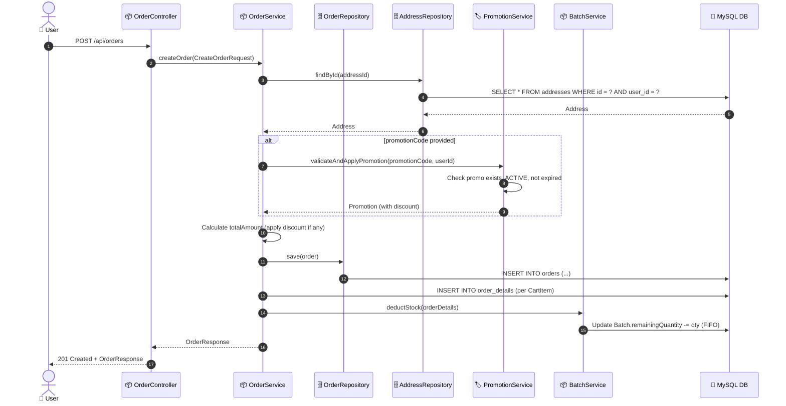
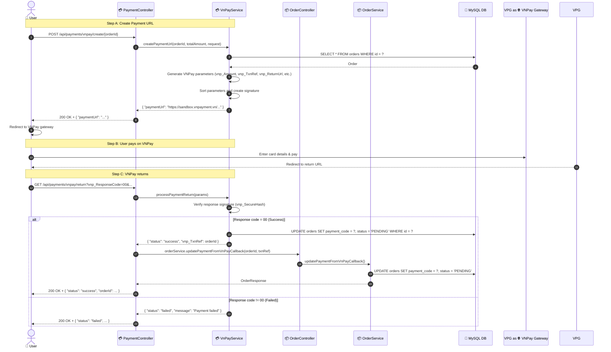
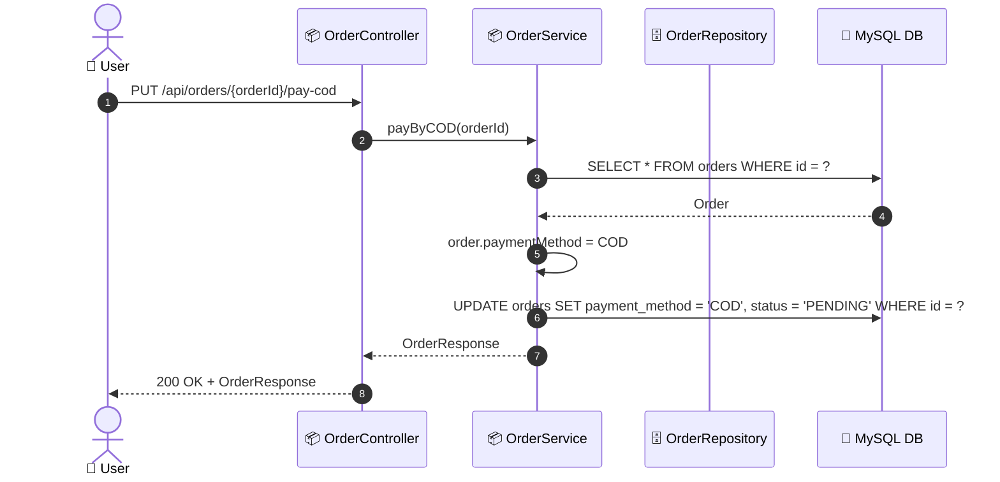
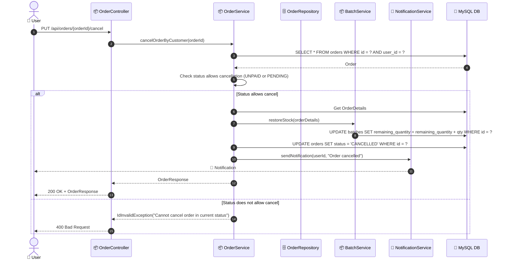
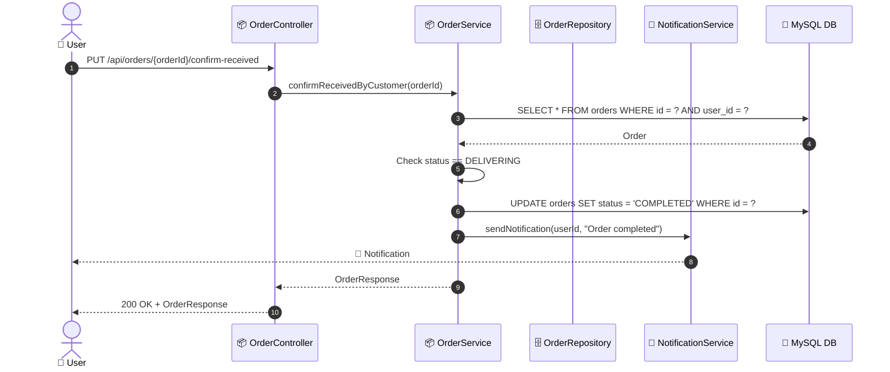
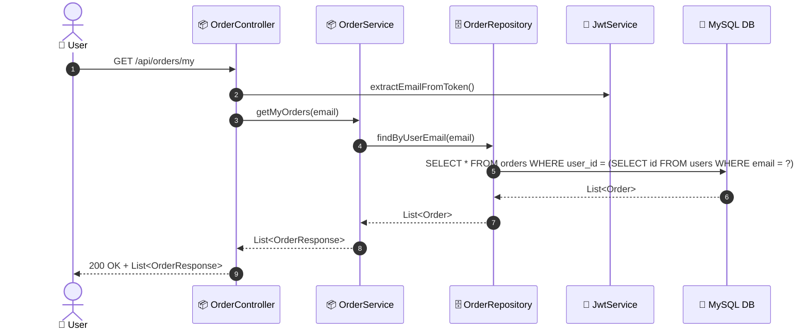

# SEQ-004: Checkout & Pay

> **Sequence ID:** SEQ-004
> **Maps to:** UC-004
> **Phiên bản:** 1.0.0
> **Ngày:** 2026-04-25

---

## 1. Create Order

---

## 2. Pay by VNPay

---

## 3. Pay by COD

---

## 4. Cancel Order

---

## 5. Confirm Delivery

---

## 6. Get My Orders

---

*Generated by Senior BA Agent | BookStore Backend | 2026-04-25*
