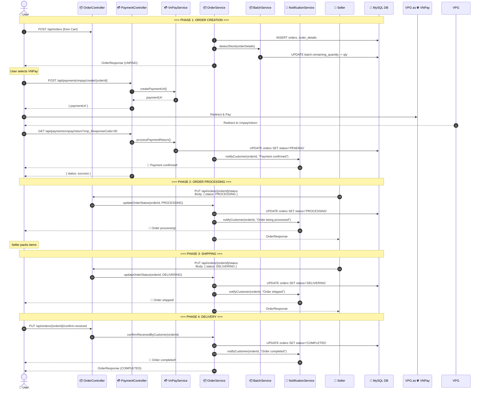
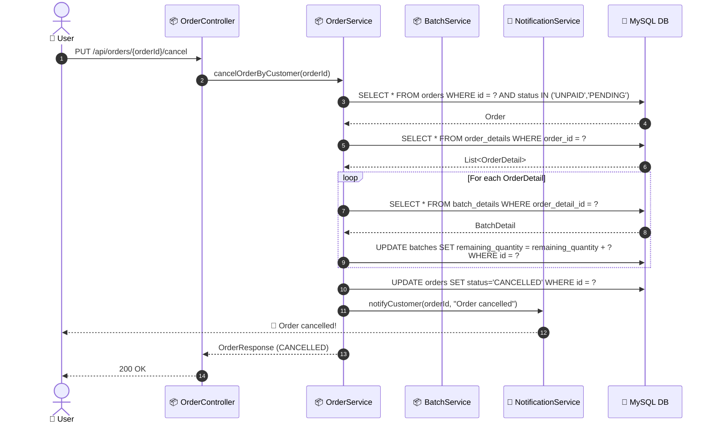
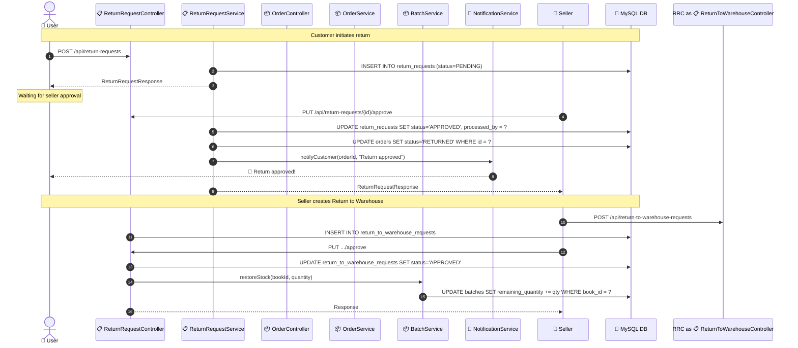

# SEQ-005: Order Fulfillment Flow

> **Sequence ID:** SEQ-005
> **Maps to:** UC-005
> **Phiên bản:** 1.0.0
> **Ngày:** 2026-04-25

---

## Full Order Lifecycle (Customer to Completion)

---

## Order Cancellation Flow (PENDING -> CANCELLED)

---

## Order Return Flow

---

*Generated by Senior BA Agent | BookStore Backend | 2026-04-25*
