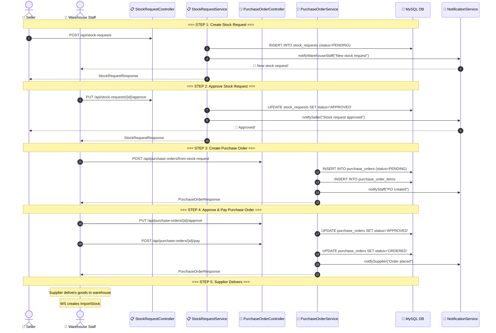
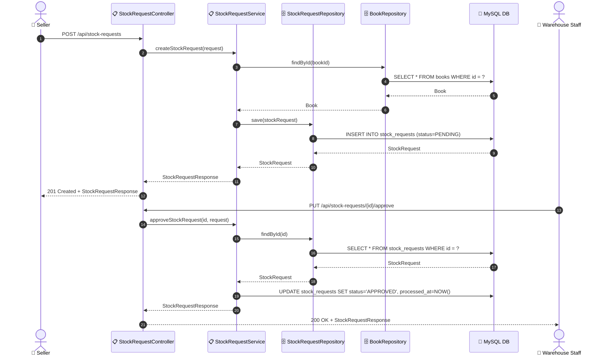
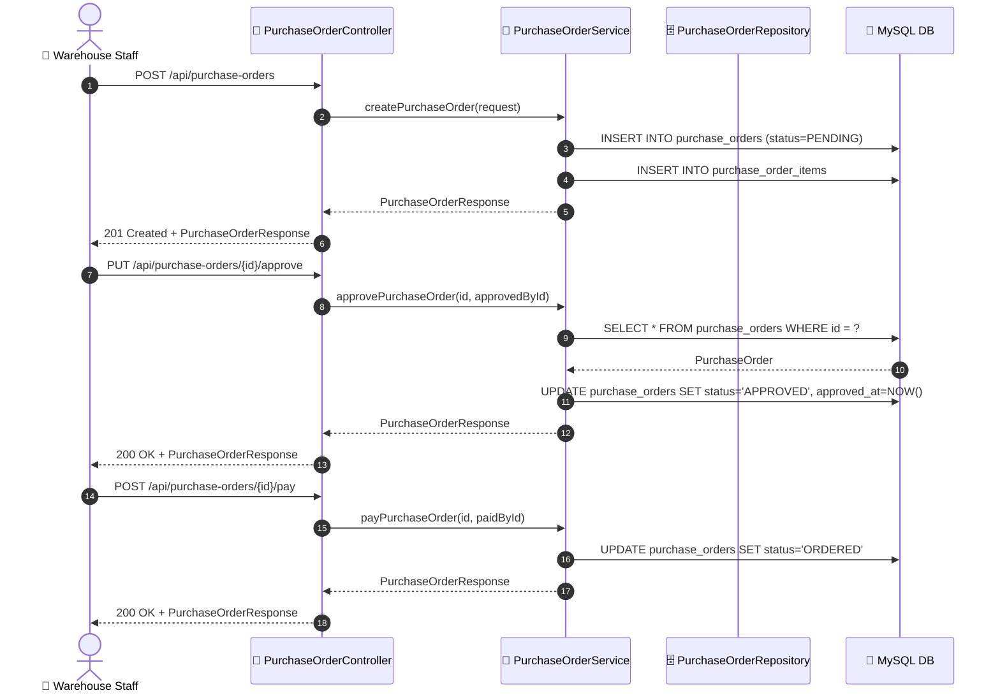

# SEQ-006: Stock Replenishment

> **Sequence ID:** SEQ-006
> **Maps to:** UC-006 / UC-010
> **Phiên bản:** 1.0.0
> **Ngày:** 2026-04-25

---

## Stock Replenishment Full Flow

---

## Stock Request Create & Approve

---

## Purchase Order Create & Approve

---

*Generated by Senior BA Agent | BookStore Backend | 2026-04-25*
