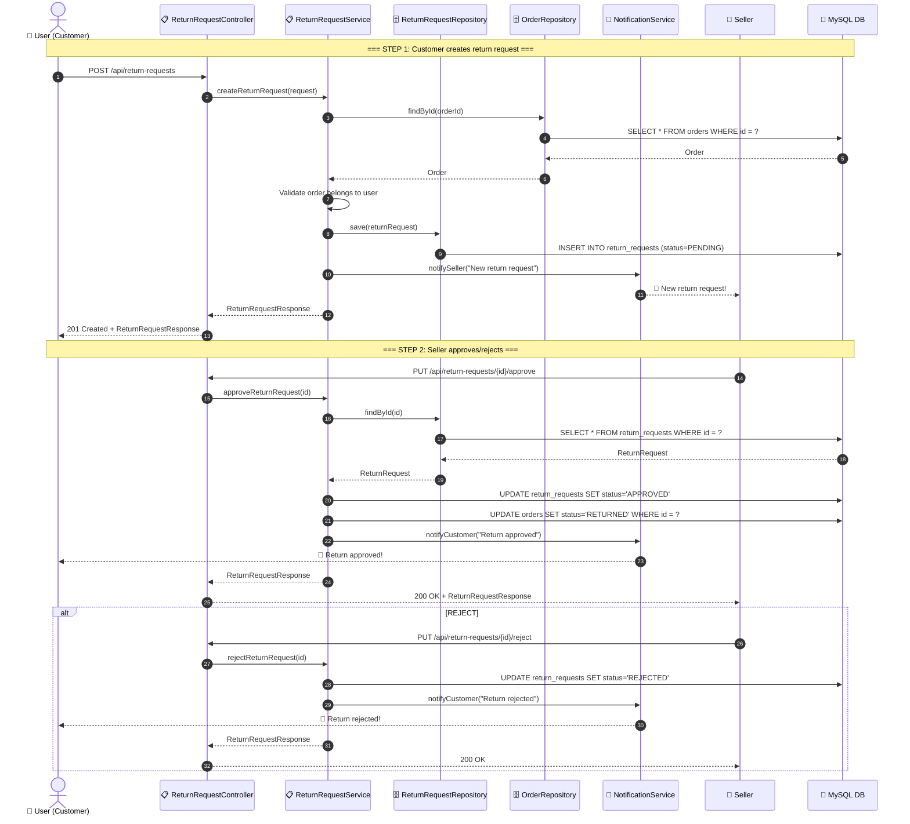
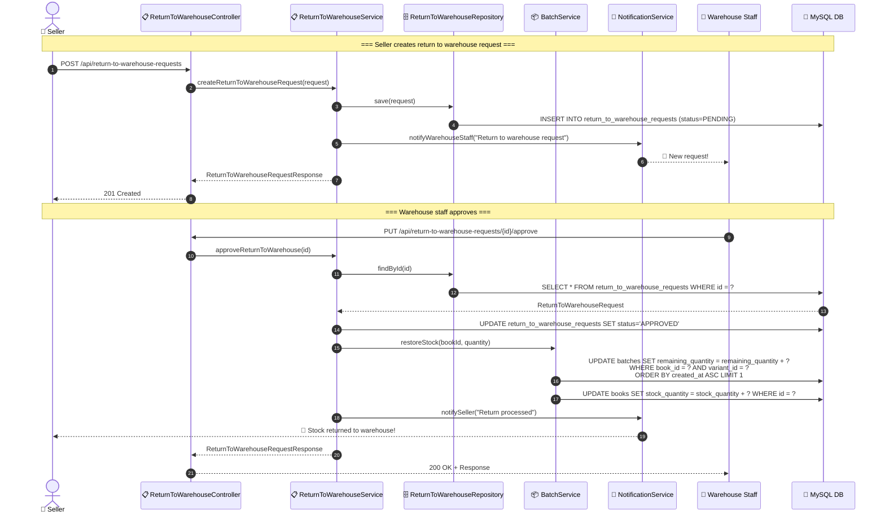

# SEQ-007: Return Request Flow

> **Sequence ID:** SEQ-007
> **Maps to:** UC-007
> **Phiên bản:** 1.0.0
> **Ngày:** 2026-04-25

---

## Customer Return Request Flow

---

## Return to Warehouse Flow

---

*Generated by Senior BA Agent | BookStore Backend | 2026-04-25*
